# Overview

BlackCat / ALPHV (Nov 2021,3d7cf20ca6476e14e0a026f9bdd8ff1f26995cdc5854c3adb41a6135ef11ba83 (SHA-256) is a Rust-based PE32 ransomware that refuses to execute without a mandatory 32-byte --access-token, acting as an anti-analysis gate. Once detonated, it self-elevates privileges, enumerates local and SMB/NetBIOS network shares, kills file-locking processes, deletes shadow copies, and encrypts files using AES-128-CTR with per-file keys wrapped under embedded RSA-2048, appending a per-build extension (.sykffle in this sample). Ransom notes are dropped as .txt and .png, and the desktop wallpaper is replaced.

- PE32 EXE
- Rust programming language
  

- We can see Rust libraries being referenced

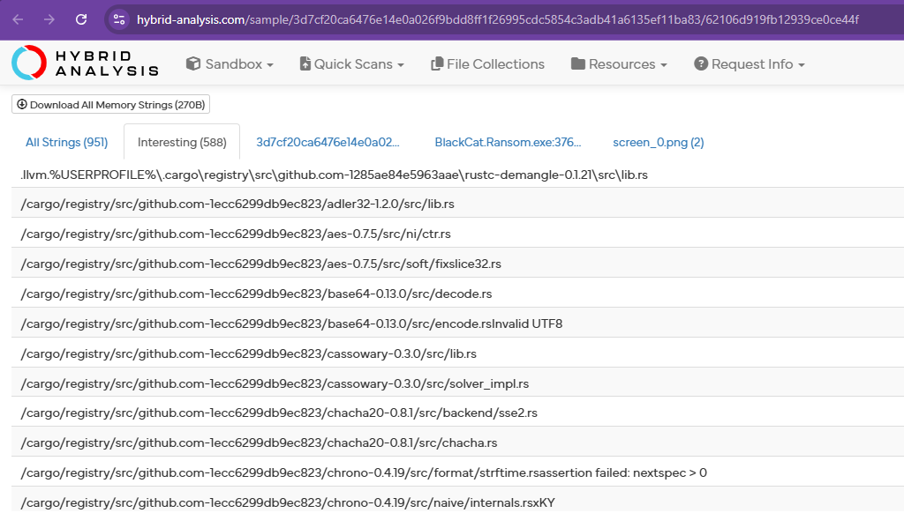

- Mostly all sections are not packed except rdata. It typically means that the executable code (.text section) remains in its original, readable form, while the data referenced by that code such as strings, configuration, or API import information is hidden.

- Once we try to execute it, it will not run.

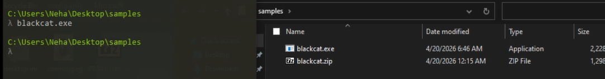

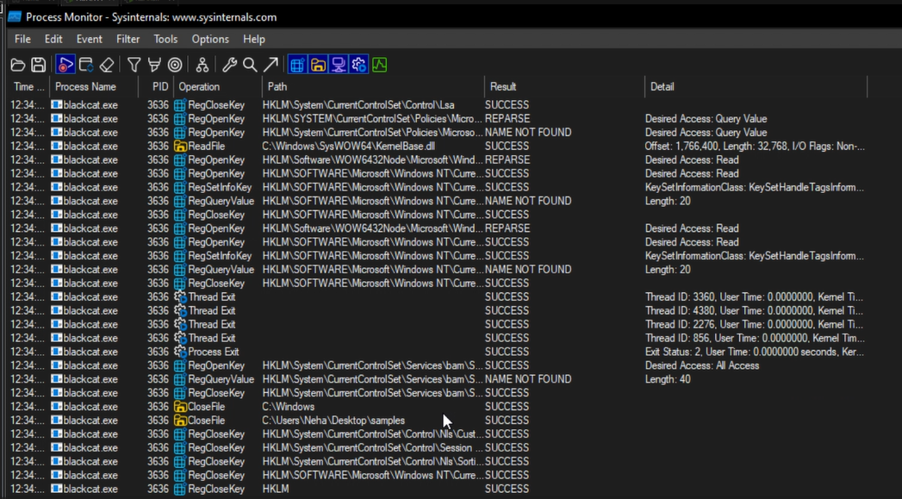

- So after checking in the disassembler we can find GetCommandLine function used. 

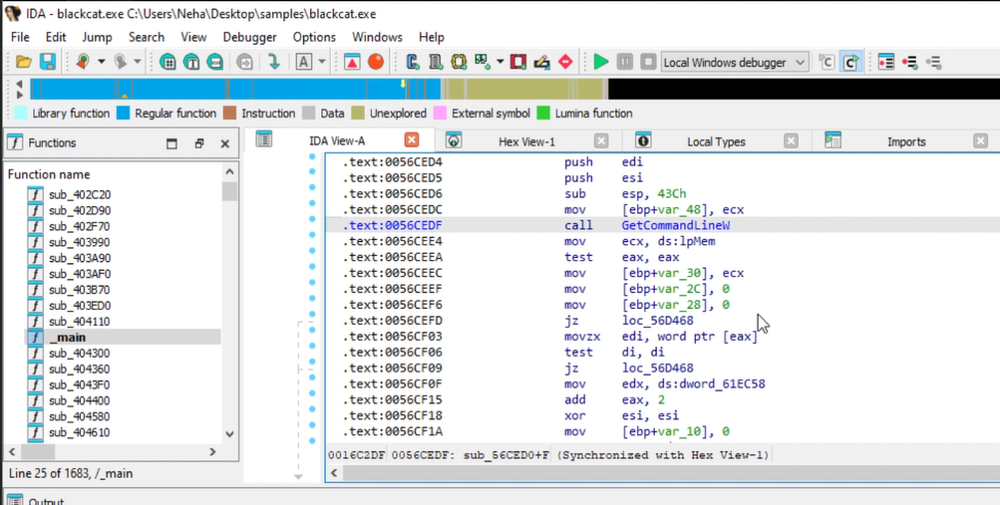

- We can identify through strings some letters like -, h, e, l, p so looking for possible arguments

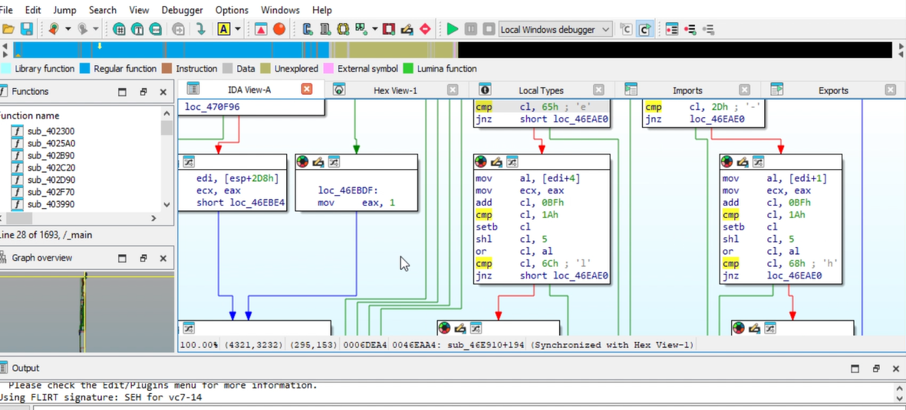

- So we can get information with -h argument in detail about the ransomware and what options it provides.

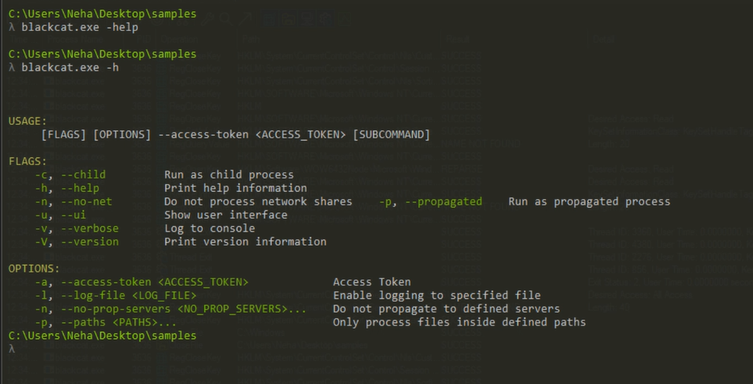

- So we can identify from here that it requires access token to execute which is the anti-analysis technique so we provide a random access token and try executing it with multiple options like do not process network shares, log in log.txt and only process ./new path for encryption

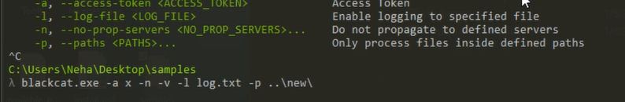

- We can see that it is logging in log.txt

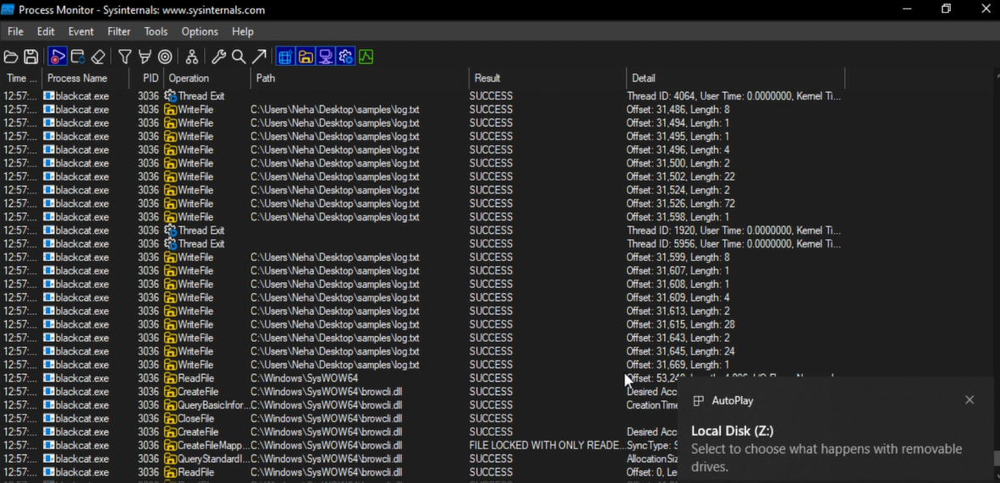

- We can see the logs here

- We can see here it used the ./new path to strictly include so rest files and folders are also processed as we can see in the logs its trying to access all files local, removable and network shares we explicitly asked to not process so it does not. 

- It has the list of processes and services to kill.

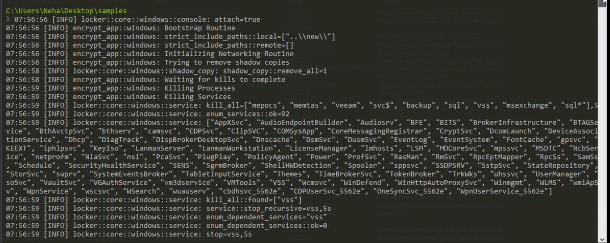

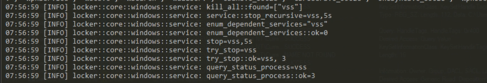

- Now it tries to mount hidden partitions. discovers local drives default paths and cleans up recycle bin. It also tried to use samba for enumerating more. 

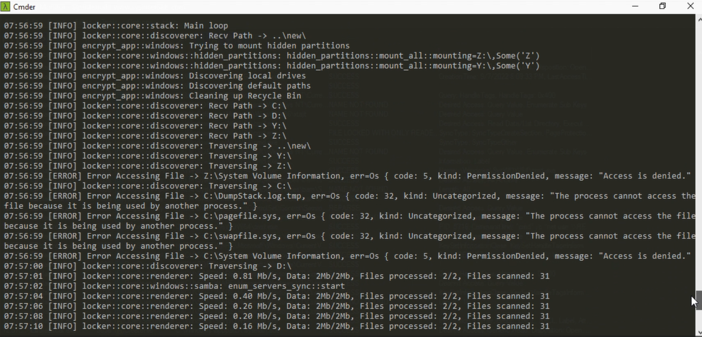

- It discovered REMNUX as well through samba but got error=53 for enum_share_sync, then discovered netbios server for remnux and processed.

- At the end it dropped ransomnote and added .sykffle extension, added desktop note and removed shadow volume copies

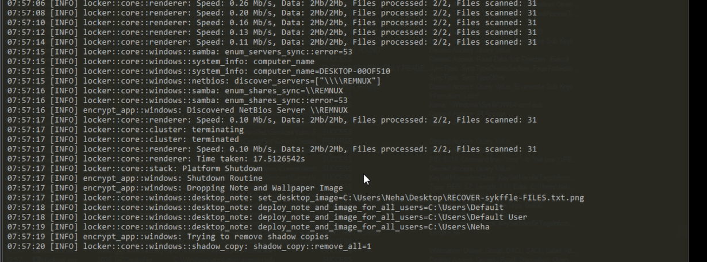

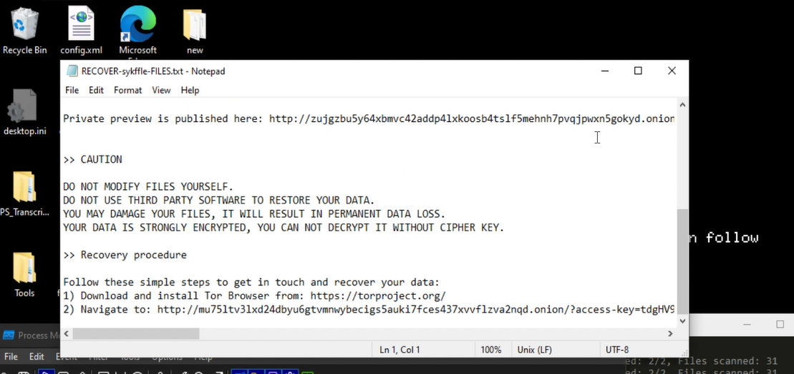

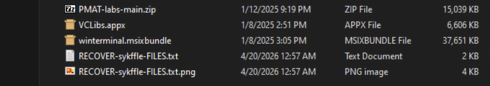

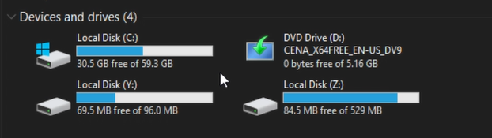

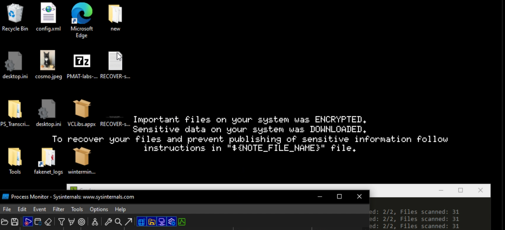

https://hybrid-analysis.com/sample/3d7cf20ca6476e14e0a026f9bdd8ff1f26995cdc5854c3adb41a6135ef11ba83/62106d919fb12939ce0ce44f
