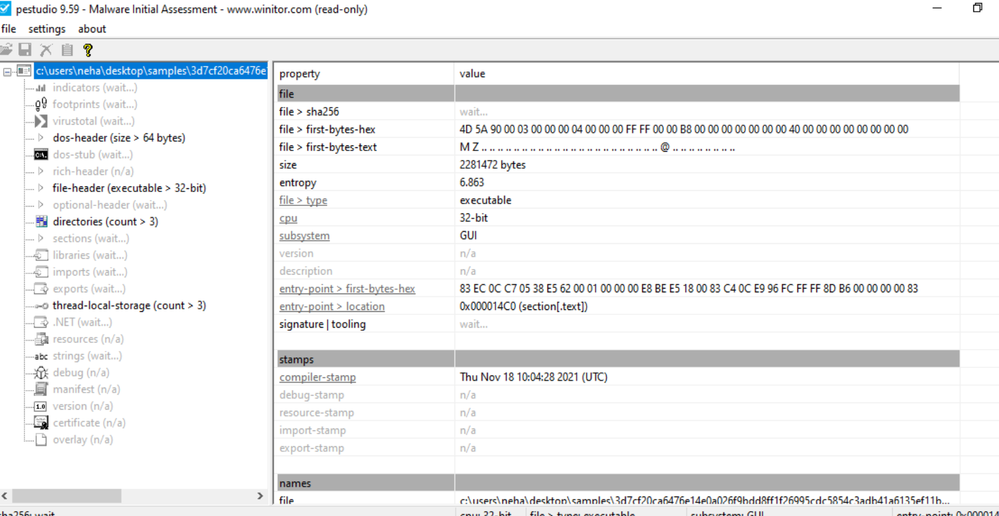
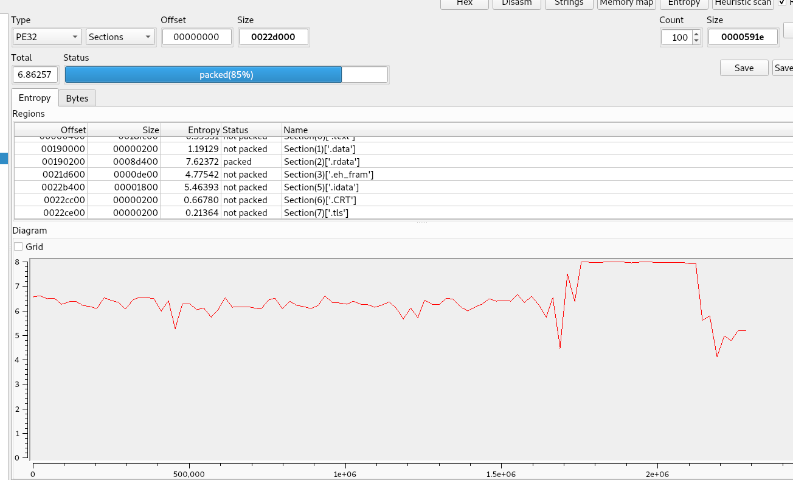

# Overview

- PE32 EXE

- Mostly all sections are not packed except rdata. It typically means that the executable code (.text section) remains in its original, readable form, while the data referenced by that code such as strings, configuration, or API import information is hidden.

