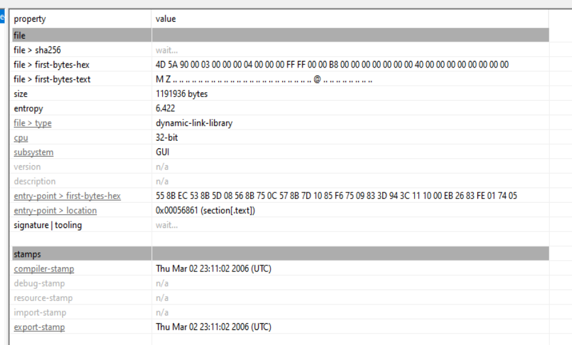
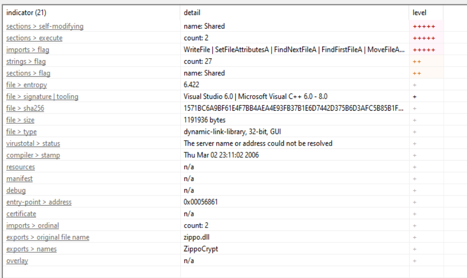
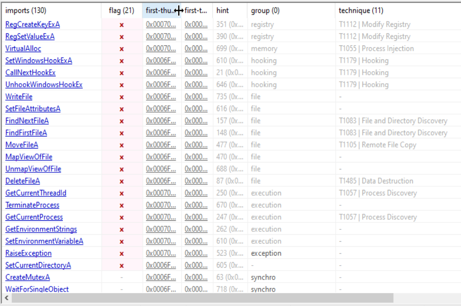
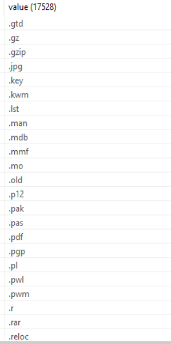
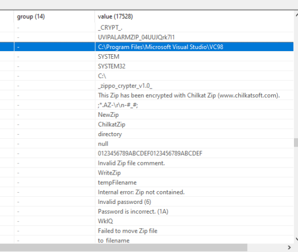
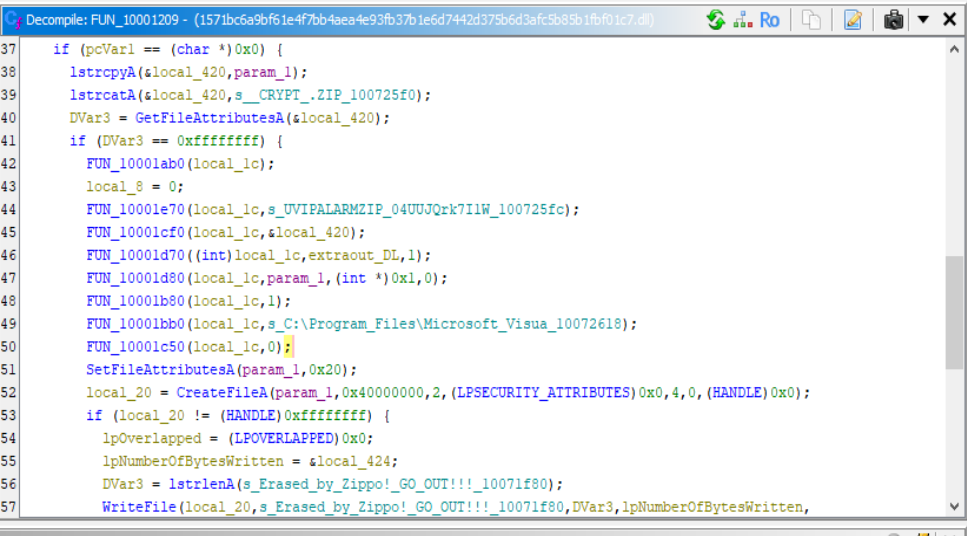

# Overview

Cryzip (2006, 0b3a49b3172fc65db607fcb1b8029820ec11c5b6 (SHA1)) is a 32-bit DLL written in MS Visual C++ 6.0 that exports a single function, ZippoCrypt, and uses the legitimate Chilkat ZIP library with a hardcoded password to "encrypt" files. It creates a mutex _zippo_crypter_v1.0_, scans for target file extensions, compresses each file into a password-protected _CRYPT_.ZIP, overwrites the original with the string "Erased by Zippo! GO OUT!!!", and deletes it. A ransom note (AUTO_ZIP_REPORT.TXT) is dropped demanding payment to an e-gold account. 

- Compiler stamp 2006 year
- PE file 32 bit DLL

- MS Visual C++ 6.0

Exports : ZippoCrypt

Imports:

- Indicating registry modification, Scanning of files for encryption, Deletion of files i.e., original ones.

Scanning for file extensions

- Chilkat zip identified along with the hardcoded password highlighted

- Mutex created \_zippo_crypter_v1.0_
- Strings also contain:
    - AUTO_ZIP_REPORT.TXT
    - _CRYPT.ZIP : added to encrypted file names
    - ZIPPO_CRYPTOR.ZIP
    - OUR EGOLD ACCOUNT : for ransom payment

- Function for encryption being used

- The core function receives a file path, skips already encrypted files and the ransom note, compresses the target into a password-protected ZIP (_CRYPT_.ZIP) using hardcoded password, overwrites the original file with "Erased by Zippo! GO OUT!!!", then deletes it.

### Sources
- Manual Analysis
- https://hybrid-analysis.com/sample/1571bc6a9bf61e4f7bb4aea4e93fb37b1e6d7442d375b6d3afc5b85b1fbf01c7/69b3c3280dc3fda4cd08660e
