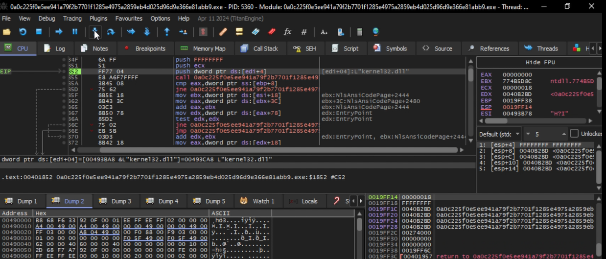
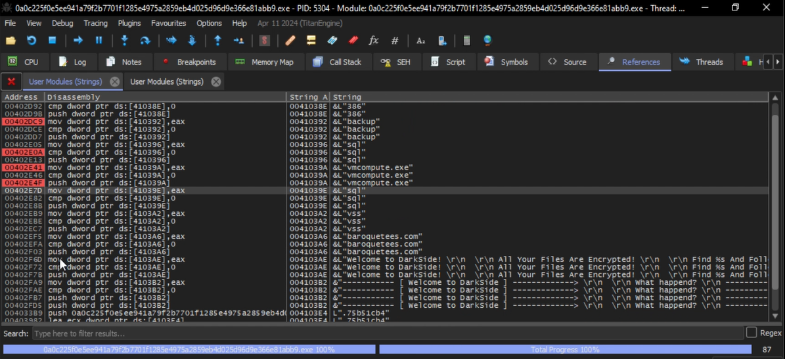
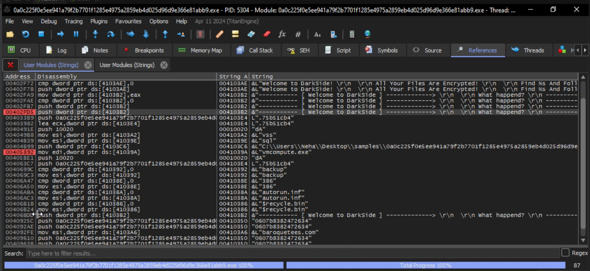
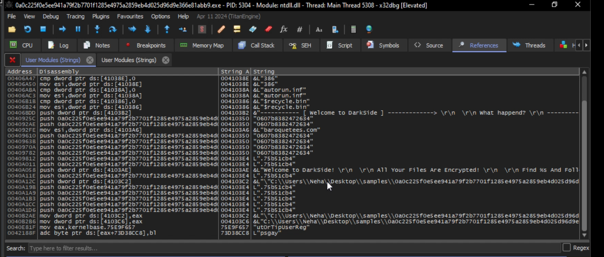

# Overview

DarkSide (2020, 0A0C225F0E5EE941A79F2B7701F1285E4975A2859EB4D025D96D9E366E81ABB9 (SHA-256)) is a packed/obfuscated PE32 executable written in Microsoft Visual C++, exhibiting high entropy and minimal visible strings or imports. It uses a two-stage cryptographic routine — expanding a hardcoded 16-byte pattern into a 128-byte array via a custom shuffle, then running standard RC4 KSA on a 256-byte S-box with an attacker-supplied key — to decrypt its embedded configuration containing C2 servers (e.g., baroquetes[.]com), kill-list processes, ransom note text, and ignore-list paths (autorun, RecycleBin, etc.). API resolution is performed dynamically using a hash-based lookup against DLL and function names (e.g., a fixed 4-byte hash for kernel32.dll) to evade static analysis.

- PE32 EXE
- Microsoft Visual C++

- Obfuscated / packed since less strings and imports and high entropy

- It is encrypted using custom algorithm

- The ransomware first expands a hard‑coded 16‑byte pattern into a 128‑byte array using a custom shuffling and decrementing routine. Then it runs the standard RC4 key scheduling algorithm on the full 256‑byte S‑box, using an attacker‑supplied key. 

- The resulting RC4 state is used to decrypt the ransomware’s embedded configuration, which contains settings like C2 servers, encryption parameters, and ransom note instructions. This two‑stage approach (custom expansion + standard RC4 KSA) helps evade static detection while still using a well‑understood cryptographic primitive.

- For each DLL to be loaded, there is a hash function that is applied to the DLL name, and the 4-byte result is compared to hardcoded values. For example, the following value corresponds to kernel32.dll

- The process retrieves the address of multiple export functions based on similar hash values computed using the same algorithm

- We can identify from the decrypted strings the processes aimed for termination, the ransom note and some c2 address as well : baroquetes[.]com

- The following files will be ignored by the ransomware like autorun, recyclebin

