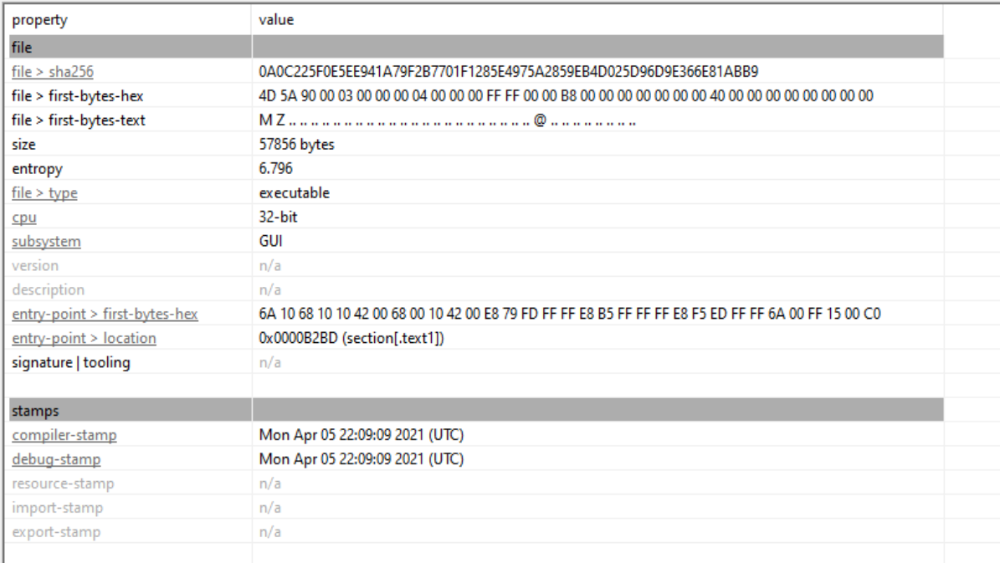
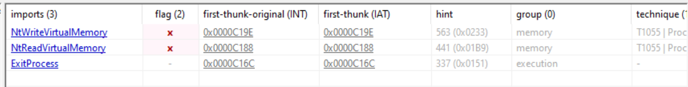
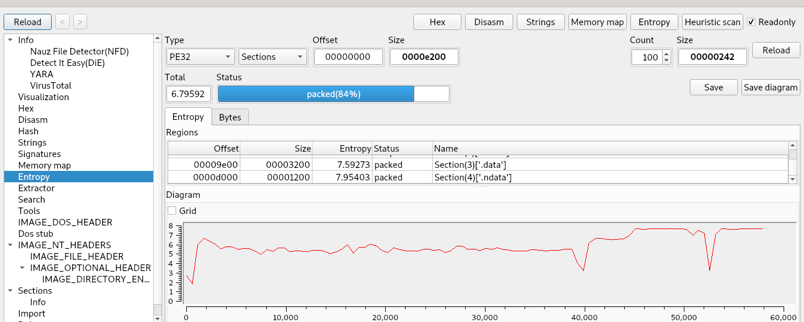
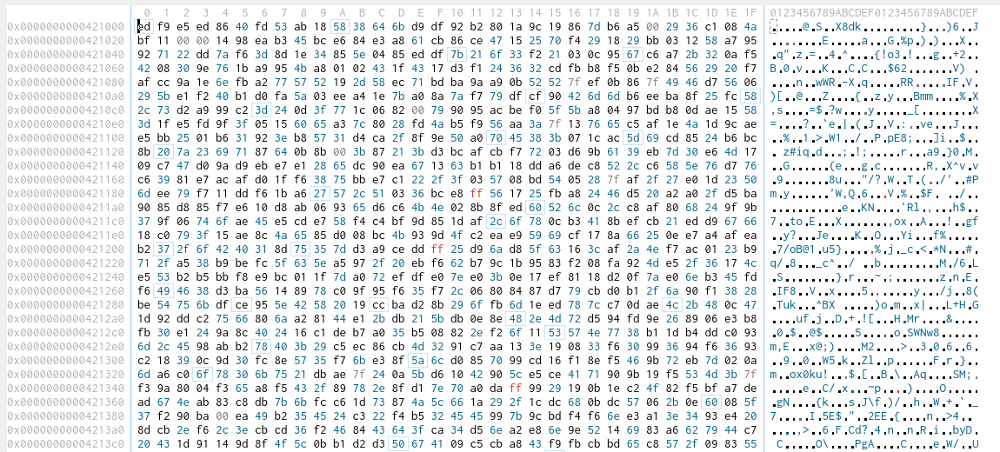
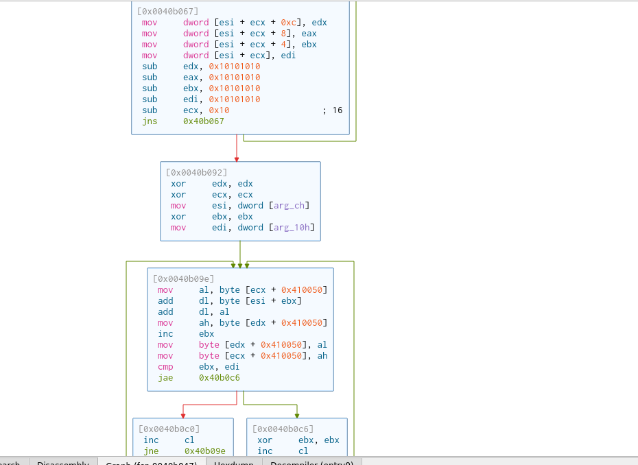

# Overview

- PE32

- Obfuscated / packed since less strings and imports and high entropy

- It is encrypted using custom algorithm

- The ransomware first expands a hard‑coded 16‑byte pattern into a 128‑byte array using a custom shuffling and decrementing routine. Then it runs the standard RC4 key scheduling algorithm on the full 256‑byte S‑box, using an attacker‑supplied key. 

- The resulting RC4 state is used to decrypt the ransomware’s embedded configuration, which contains settings like C2 servers, encryption parameters, and ransom note instructions. This two‑stage approach (custom expansion + standard RC4 KSA) helps evade static detection while still using a well‑understood cryptographic primitive.

