# Overview

- PE32 EXE File Unpacked version analysing.
- Visual Studio Compiled C/C++

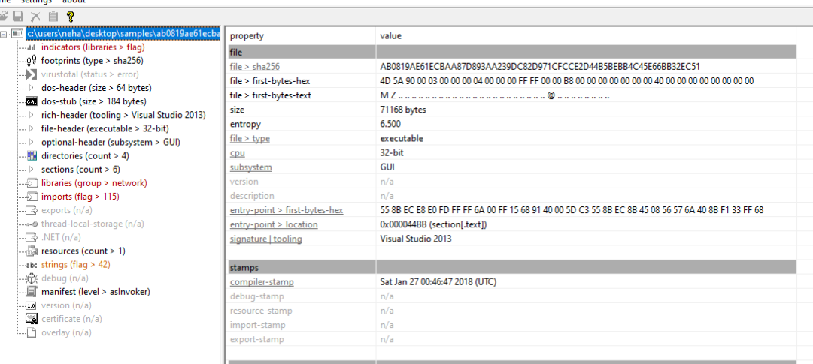

- First function after entry, got the list of processes being terminated

`
  local_a8[0] = L"msftesql.exe";
  local_a8[1] = L"sqlagent.exe";
  local_a8[2] = L"sqlbrowser.exe";
  local_a8[3] = L"sqlservr.exe";
  local_a8[4] = L"sqlwriter.exe";
  local_a8[5] = L"oracle.exe";
  local_a8[6] = L"ocssd.exe";
  local_a8[7] = L"dbsnmp.exe";
  local_a8[8] = L"synctime.exe";
  local_a8[9] = L"mydesktopqos.exe";
  local_a8[10] = L"agntsvc.exeisqlplussvc.exe";
  local_a8[0xb] = L"xfssvccon.exe";
  local_a8[0xc] = L"mydesktopservice.exe";
  local_a8[0xd] = L"ocautoupds.exe";
  local_a8[0xe] = L"agntsvc.exeagntsvc.exe";
  local_a8[0xf] = L"agntsvc.exeencsvc.exe";
  local_a8[0x10] = L"firefoxconfig.exe";
  local_a8[0x11] = L"tbirdconfig.exe";
  local_a8[0x12] = L"ocomm.exe";
  local_a8[0x13] = L"mysqld.exe";
  local_a8[0x14] = L"mysqld-nt.exe";
  local_a8[0x15] = L"mysqld-opt.exe";
  local_a8[0x16] = L"dbeng50.exe";
  local_a8[0x17] = L"sqbcoreservice.exe";
  local_a8[0x18] = L"excel.exe";
  local_a8[0x19] = L"infopath.exe";
  local_a8[0x1a] = L"msaccess.exe";
  local_a8[0x1b] = L"mspub.exe";
  local_a8[0x1c] = L"onenote.exe";
  local_a8[0x1d] = L"outlook.exe";
  local_a8[0x1e] = L"powerpnt.exe";
  local_a8[0x1f] = L"steam.exe";
  local_a8[0x20] = L"sqlservr.exe";
  local_a8[0x21] = L"thebat.exe";
  local_a8[0x22] = L"thebat64.exe";
  local_a8[0x23] = L"thunderbird.exe";
  local_a8[0x24] = L"visio.exe";
  local_a8[0x25] = L"winword.exe";
  local_a8[0x26] = L"wordpad.exe";
`

- Terminating these processes

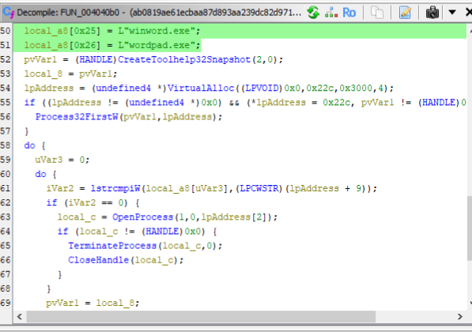

- Checks for AV processes

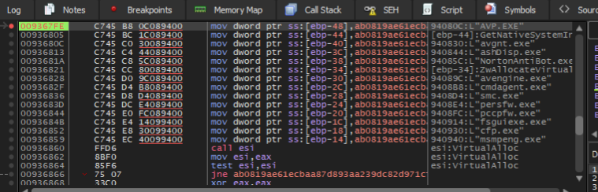

- RSA being used

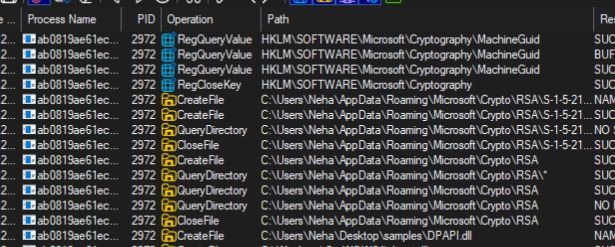

- Collecting user information

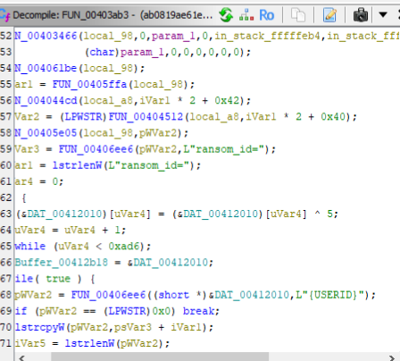

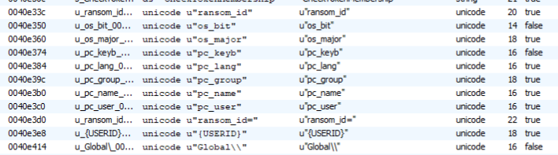

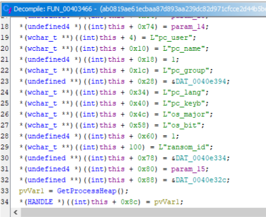

- Checks for All Letters for certain drives only

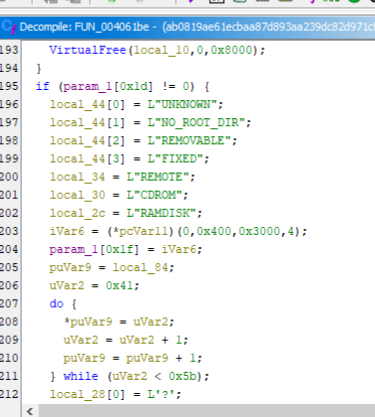

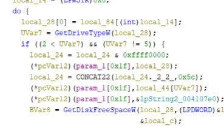

- Based on this we can see only Fixed, Remote and RAMDISK are targetted rest skipped

- Also checks for finding ip through GET request to a domain
"ipv4bot[.]whatismyipaddress[.]com"

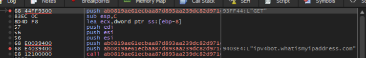

- C2 domain gandcrab[.]bit is tried to lookup for encryption process starting and sending details to c2

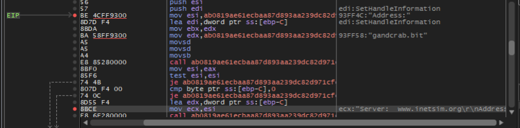

- Recursive lookup for .bit domains.

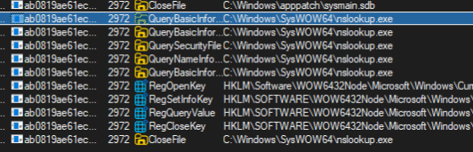

- This function is the ransomware’s “call home” mechanism. It sends the attacker:

The victim’s public encryption key (or a unique machine ID) via pub_key

A private identifier (possibly an encrypted victim ID or a second key) via priv_key

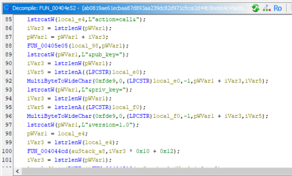

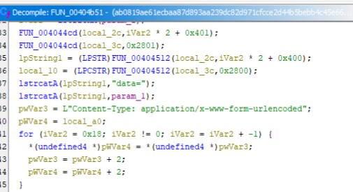

- sending data to c2

- This is why till the gandcrab[.]bit is not present it does not execute

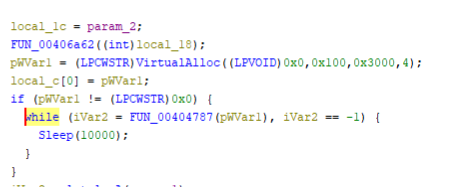

- Self destruction after encryption

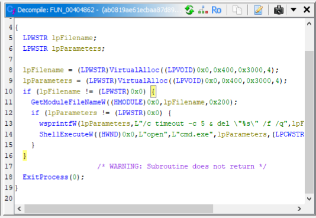

- Ransom Note

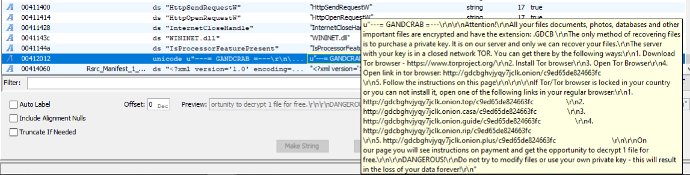