# Overview

- PE32 EXE File Unpacked version analysing.
- Visual Studio Compiled C/C++

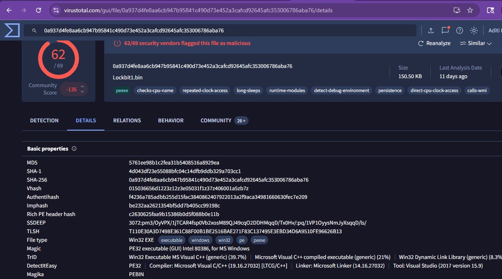

- We can see section names are normal, the entropy are a little high for the .text and the .rdata sections but not that high, which indicates binary is not packed however, it applies some obfuscation techniques.

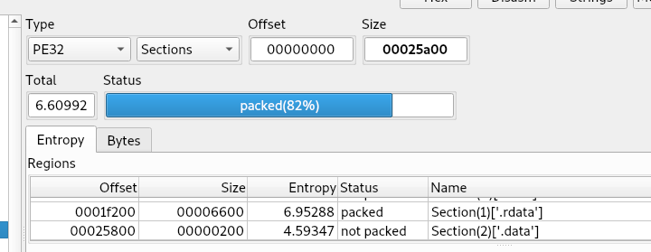

- At the entry function, it checks the NtGlobalFlag which exists in the PEB (Process Environment Block) at offset 0x68 to know whether the process is being debugged. It performs a TEST to check the value of the flag, if it equals 0x70 (which means the process is being debugged), the execution will be transferred to a block of code that exists the process.

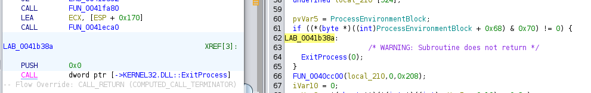

- Also it tries to impersonate the token of the logged on user via the physical console by getting session identifier of the console session to obtain the primary access token of the logged user, if it fails to get the token, it will create the process with the current security context by calling CreateProcessW however, if it manages to get the user’s access token, it will duplicate the token by calling DuplicateTokenEx then it will use the duplicate token to create the new process using CreateProcessAsUserW.

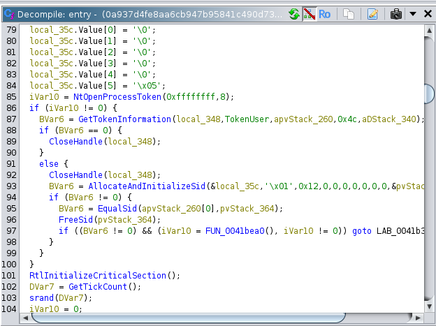

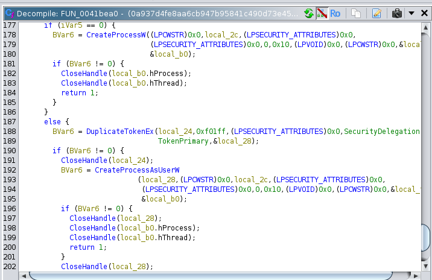

- This is used for privilege escalation or defense evasion.

- The malware generates RSA session key pair then, it will encrypt the private key using a hard-coded public key then, it stores the encrypted key in the SOFTWARE\LockBit\full registry key and the public key will be stored in SOFTWARE\LockBit\Public

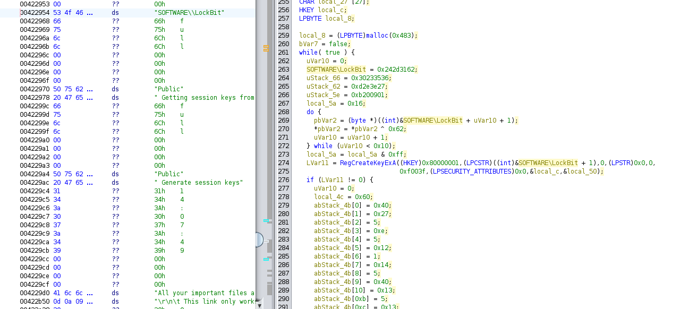

- For generating the random numbers, LockBit will use LoadLibraryA and GetProcAddress to dynamically load bcrypt.dll for importing the BCryptGenRandom API for generating 32 bytes of random numbers, and if couldn’t load libraries, it’ll call CryptAcquireContextW and CryptGenRandom to complete.

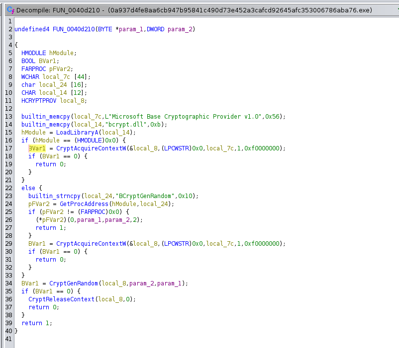

- LockBit checks admin privileges by getting the process token by calling NtOpenProcessToken, it queries that token via NtQueryInformationToken after that, it creates a user security identifier (SID) that matches the administrator group by passing WinBuiltinAdministratorsSid to CreateWellKnownSid. Finally, it calls CheckTokenMembership to check whether the current process privileges include the Administrator privileges or not.

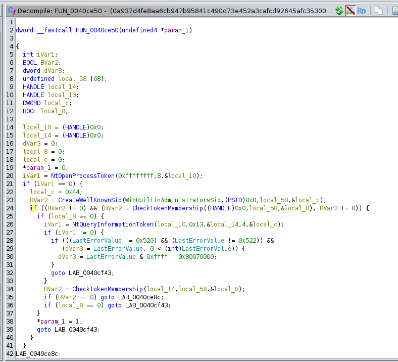

- If not running as admin, LockBit bypasses UAC using auto-elevating COM objects. It then hides itself via supMasqueradeProcess by injecting into a trusted process like explorer.exe.

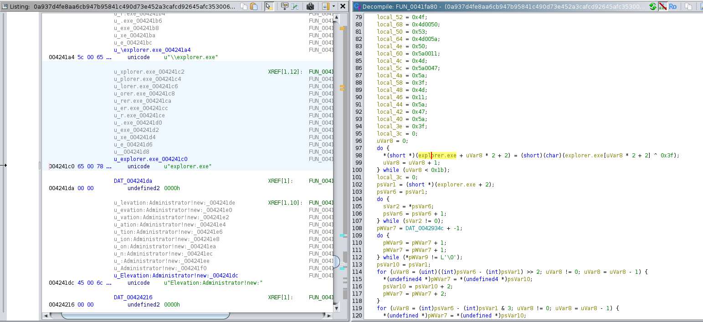

- For killing processes, it gets snapshot of running processes and enumerates proccesses, compares with list of processes and if matches it will Terminate Process.

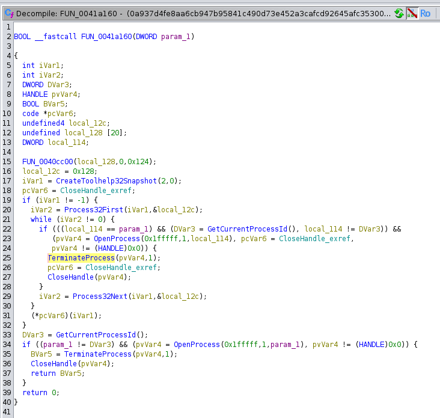

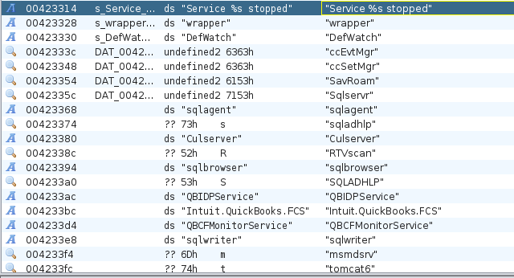

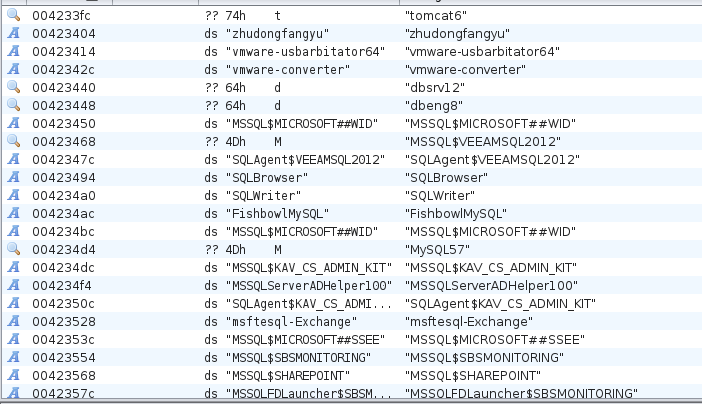

- Tries to stop these services 

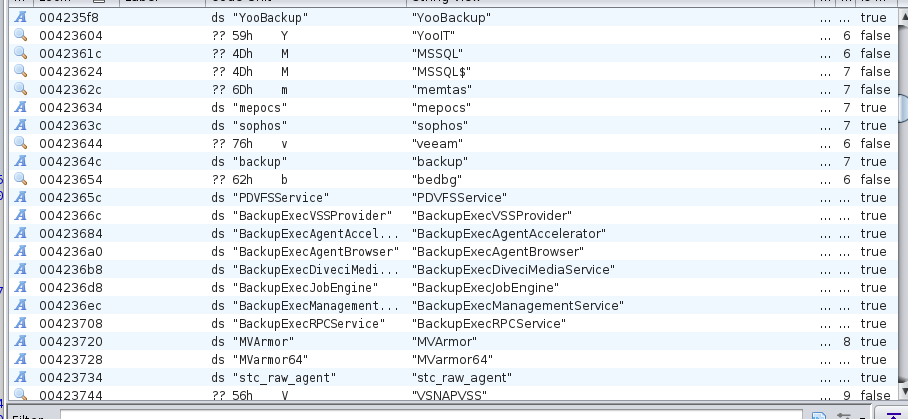

- Mutex creation

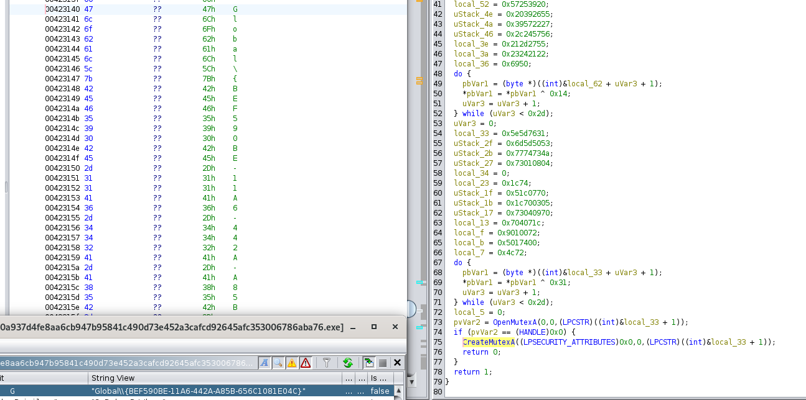

- Run key created for maintaining persistance

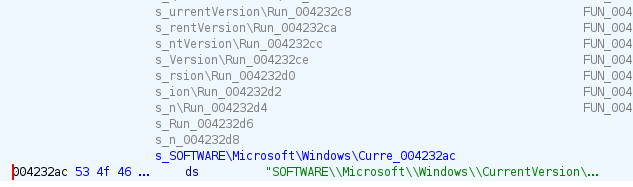

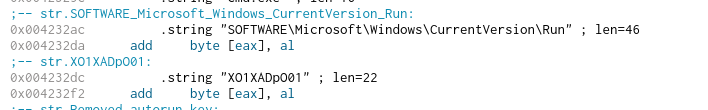

- To ensure encryption operation is not disrupted by shutting down, shutdown block reason created which Indicates that the system cannot be shut down and sets a reason string to be displayed to the user if system shutdown is initiated.

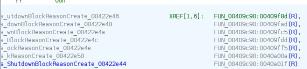

- For infecting maximum victims, Lockbit scans attached drives and network shares and finds file to encrypt. 

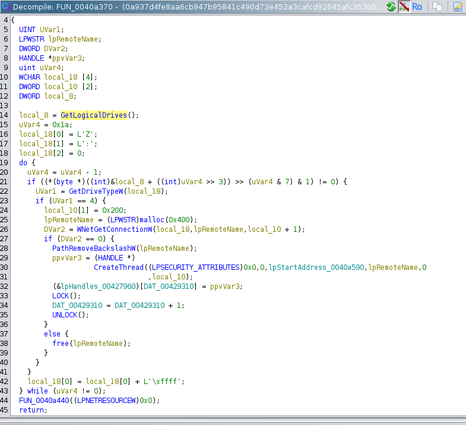

- Ransom note

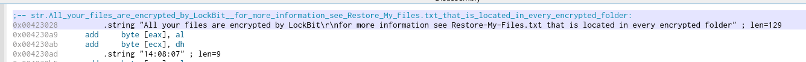

- After successful execution, it wil delete itself using this command. Pings localhost 3 times, output is discarded this is used as delay for 2-3 seconds. Then fsutil windows utility used to overwrite 512KB of file with zeroes for data wiping / corruption, then Del /f /q for quite forced deletion. 

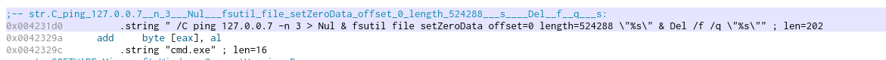

- LockBit will delete the volume shadow copies, the backup catalog, disable automatic windows recovery, and clear the windows logs as well by running the following commands.

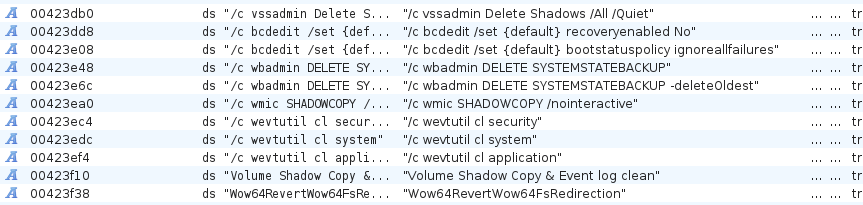

https://hybrid-analysis.com/sample/0a937d4fe8aa6cb947b95841c490d73e452a3cafcd92645afc353006786aba76/5f947a4e68a2be6b467e1f62

https://www.virustotal.com/gui/file/0a937d4fe8aa6cb947b95841c490d73e452a3cafcd92645afc353006786aba76/details

https://bazaar.abuse.ch/sample/0a937d4fe8aa6cb947b95841c490d73e452a3cafcd92645afc353006786aba76/