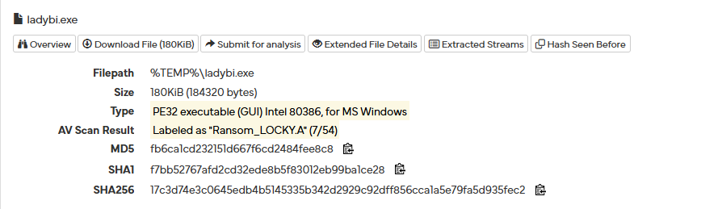

# Overview

Propagates through spammed mails that come with attachment in form of macro enabled microsoft office document file with subjects ATTN: Invoice J-98223146 / invoice_J-12345678.doc / Rechnung-54-110090.xls
When macro enabled, macros will download Locky from remote server, store it in Temp folder and execute it.

Here is the analysis of one of the doc files captured
https://hybrid-analysis.com/sample/97b13680d6c6e5d8fff655fe99700486cbdd097cfa9250a066d247609f85b9b9/56c33fcbaac2ed17637b23c9

- Macro present after enabling executes it; Contains obfuscated VBS. 
- GET /34gf5y/r34f3345g.exe from www[.]jesusdenazaret[.]com[.]ve i.e., remote server containing Locky ransomware
- Dropped files including ladybi.exe = Locky ransomware
- "WINWORD.EXE" allocated memory in "%TEMP%\ladybi.exe"

https://www.virustotal.com/gui/file/17c3d74e3c0645edb4b5145335b342d2929c92dff856cca1a5e79fa5d935fec2/detection

Analysed this sample : https://bazaar.abuse.ch/sample/17c3d74e3c0645edb4b5145335b342d2929c92dff856cca1a5e79fa5d935fec2/

So when we analysed this using x32dbg we found

1. It copies itself to svchost.exe and deletes itself

Here it is the same hash as of the original file

Next when we analyse the svchost.exe further, we can see

2. Locky recovery instructions file name present here.

3. vssadmin shadow deletion i.e., deleting volume shadow copies
4. IP along with some parameters like pubkey indicating RSA encryption and c2 connection
5. Run key present indicating persistance method

6. Also we can see post request contents along with domain generated by DGA for c2 connection

7. We can see the .locky extension present here

The c2 request is to get the RSA public key and it starts encrypting once it gets the public key. 