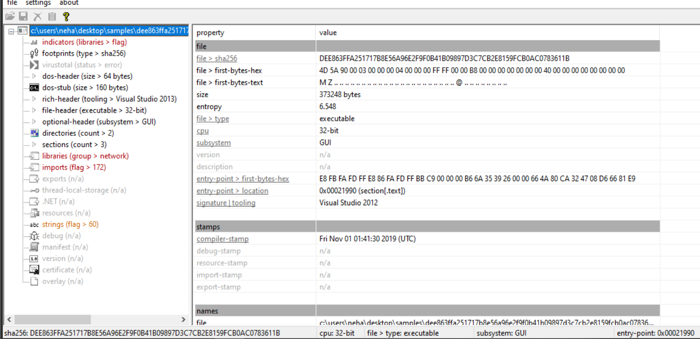
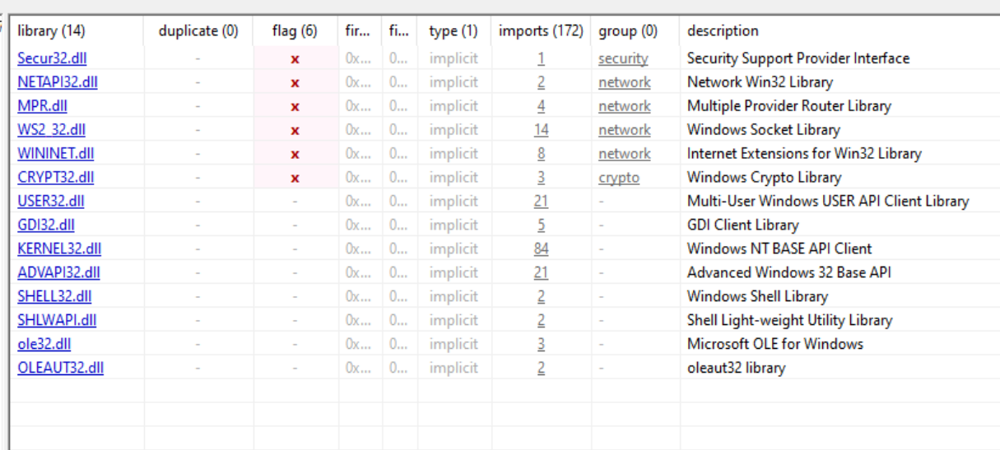
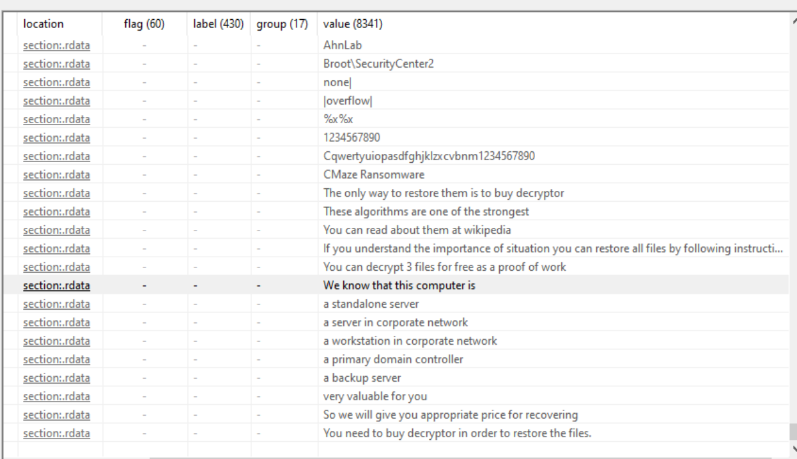
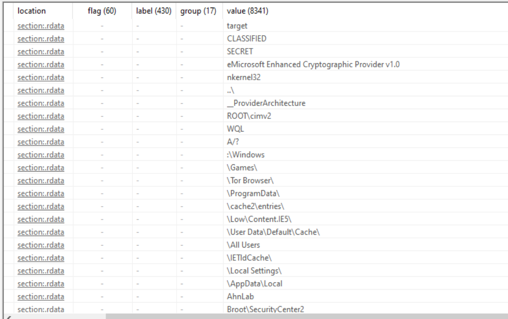
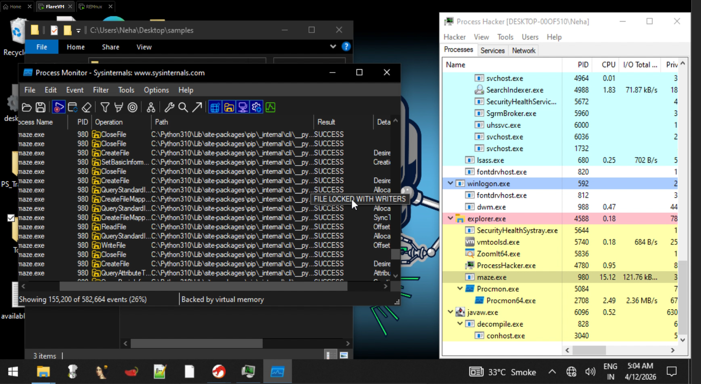
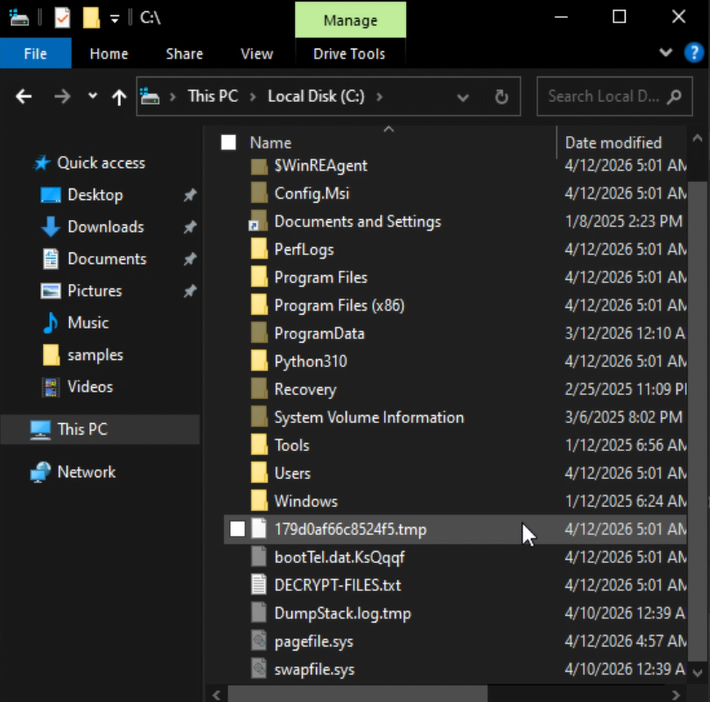
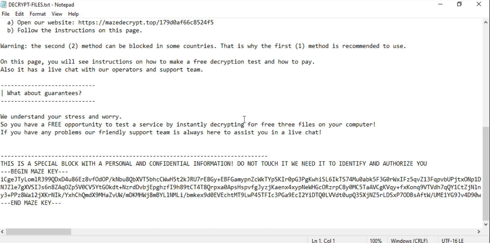
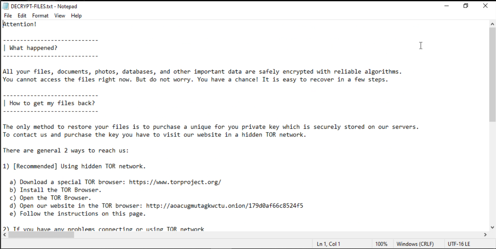

# Overview

- PE32 EXE
- Microsoft Visual C++

- Imports Libraries

- Strings contain mention of Maze, Likely ransom note and also list of type of infected device which gets ransom amount differently 

- Along with some commonly used directories, "AhnLab", Cryptographic Provider. 

After executing, it starts searching for all files and directories and starts encrypting.

In the C: Root directory which first is targetted, we can see the RansomNote dropped along with some temp file.

