# Overview

- PE32 EXE
- Microsoft Visual C/C++

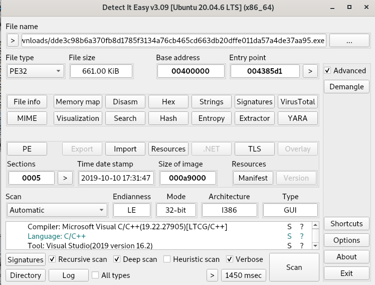

- Packing details, most of the sample looks unpacked, also we are able to get useful strings and imports.

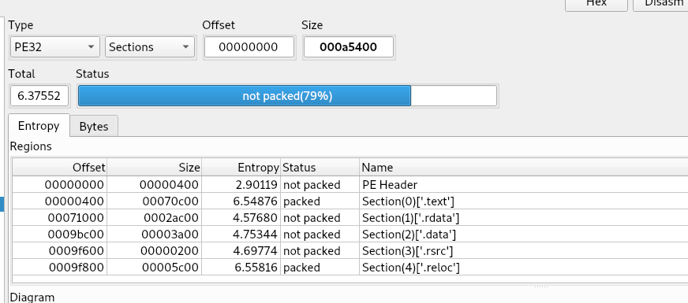

- This function is the main execution path for Medusa Locker. It performs privilege escalation checks, disables system recovery mechanisms, deletes shadow copies, and then enters an infinite loop (likely to retry encryption or maintain persistence).

- This function is the central controller. It first checks for a GUID mutex.

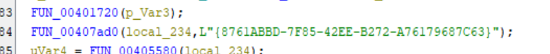

- It then performs privilege check to determine if running as ADMIN or USER and logs it.

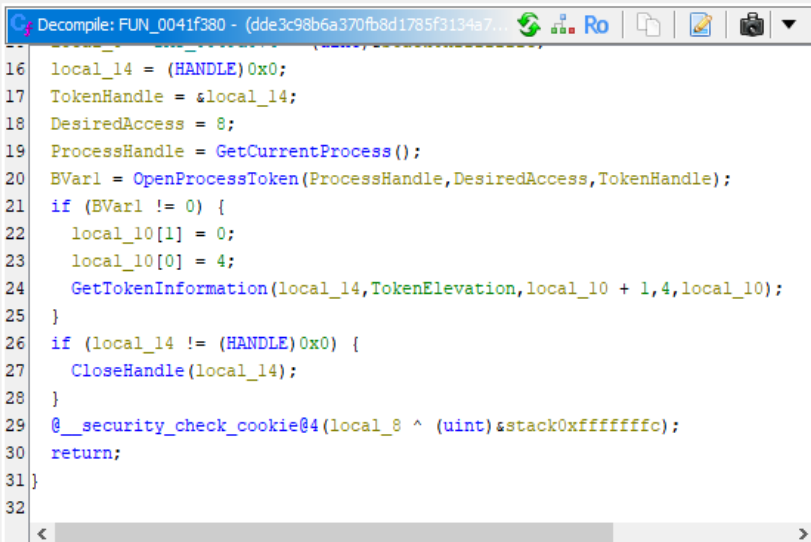

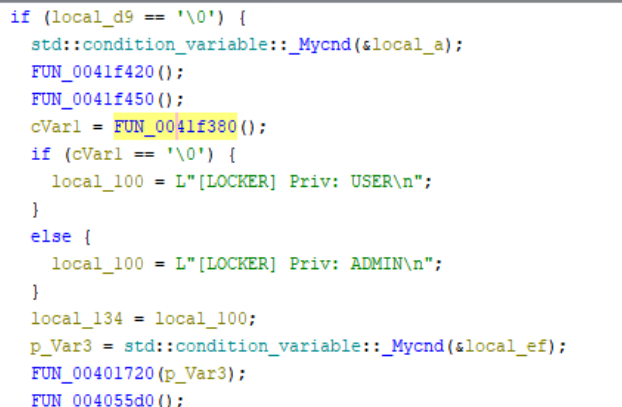

- These anti recovery commands are executed sequentially

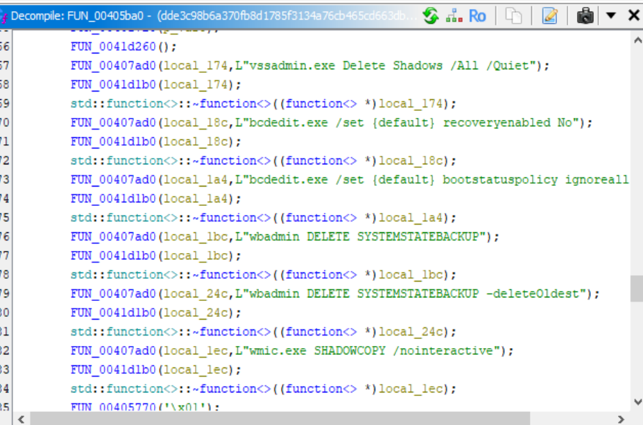

- It stops and restarts LanmanWorkstation for network connectivty to propagate through network shares

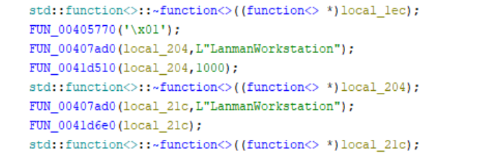

- Registry changes for EnableLinkedConnections

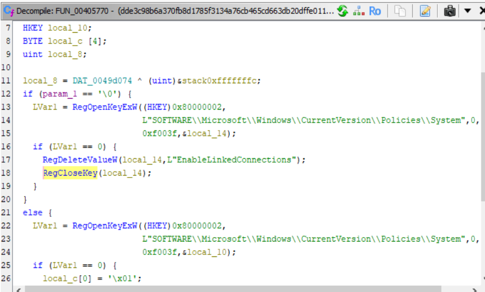

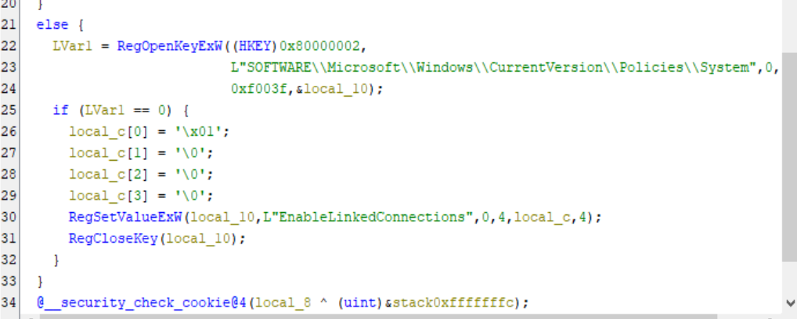

- For Persistence it writes its directory to HKLM\SOFTWARE\Medusa and creates a scheduled task named svchostt using COM.

- this function obtains the ransomware’s own directory path (stripping the filename). It uses GetModuleFileNameW. So If the executable is C:\Users\mal\medusa.exe, the function returns C:\Users\mal\.

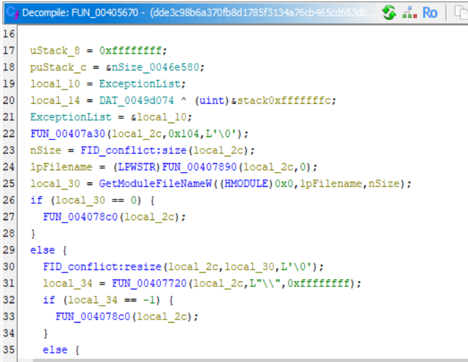

- Writes the malware’s directory into HKLM\SOFTWARE\Medusa as a REG_SZ value named Name. This fails if not running as Admin, which is consistent with the earlier privilege check.

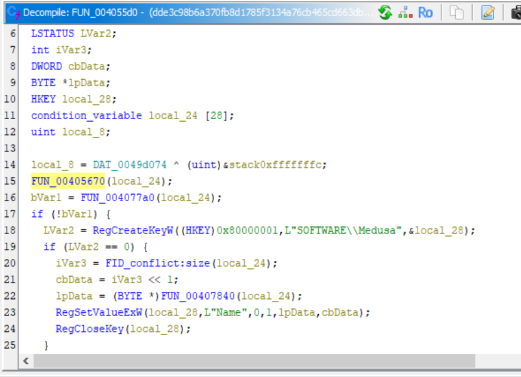

- This function creates a scheduled task using COM. It is called from the main routine with param_1 = L"svchostt" (task name) and param_2 = some process ID/handle. The task is configured to run the ransomware again, providing persistence.

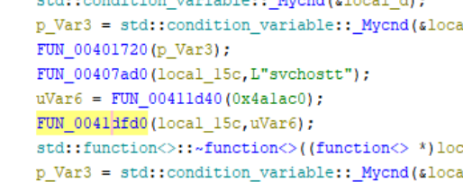

- Create Task scheduler instance

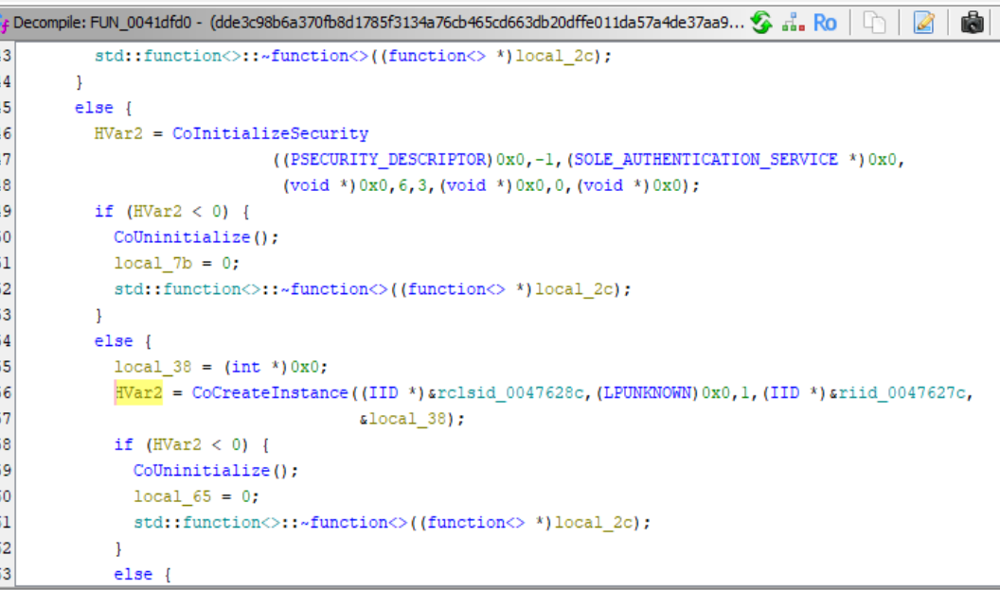

- Uses .encrypted extension 

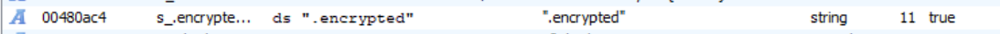

- We can find the ransom note as well

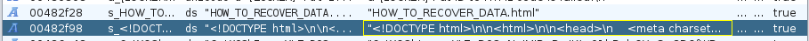

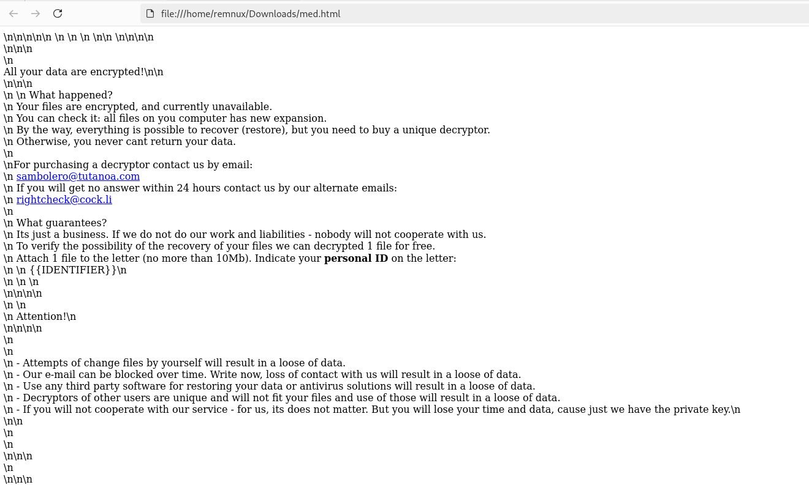

https://hybrid-analysis.com/sample/dde3c98b6a370fb8d1785f3134a76cb465cd663db20dffe011da57a4de37aa95/613f4135186cc5432070ffcf

https://www.virustotal.com/gui/file/dde3c98b6a370fb8d1785f3134a76cb465cd663db20dffe011da57a4de37aa95/details