# Overview

Ryuk (2018, 1455091954ecf9ccd6fe60cb8e982d9cfb4b3dc8414443ccfdfc444079829d56 (SHA-256)) is a Microsoft Visual C++ compiled PE32/64 executable, with the developer's PDB path (...\ConsoleApplication54\x64\Release\ConsoleApplication54.pdb) left embedded as a useful identification artefact. The WinMain routine performs initial anti-analysis checks including Sleep-based timing evasion and environment validation. Ryuk then enumerates running processes and, while skipping critical system processes (csrss.exe, explorer.exe, lsass.exe), performs classic code injection — copying its full malware image into a target process's address space and redirecting execution to a specified entry point — so that the encryption logic runs inside a legitimate process. The injected payload dynamically resolves required Windows API addresses at runtime to defeat static import-table analysis, drops a marker file in the user directory upon completion, deletes Volume Shadow Copies to prevent recovery, establishes persistence via a Run key, and drops a ransom note. 

- PE32/64 EXE
- Microsoft Visual C++

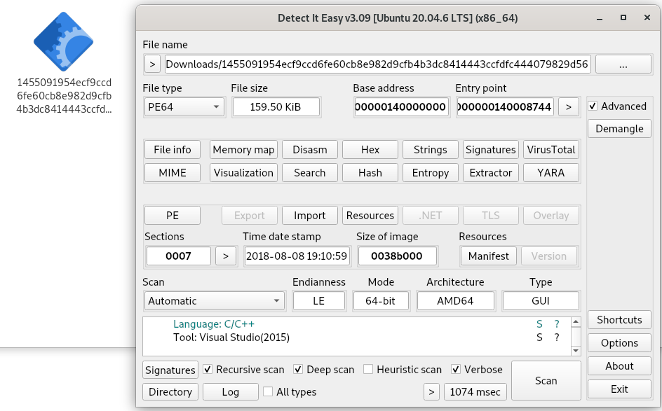

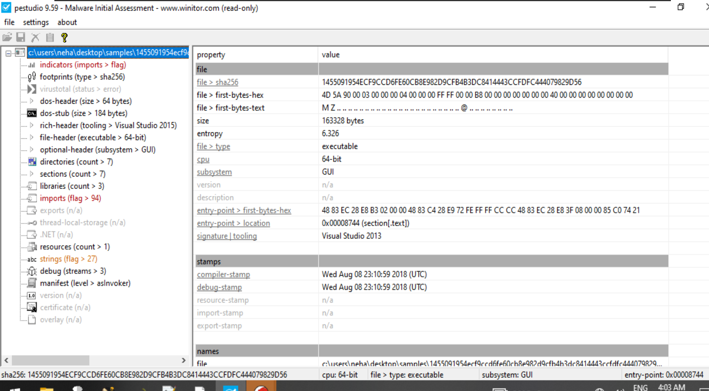

`debug > file-name,C:\Users\Admin\Documents\Visual Studio 2015\Projects\ConsoleApplication54\x64\Release\ConsoleApplication54.pdb,+` 
Used as signature

- After entrypoint, we get function WinMain which contains mostly anti-debugging techniques like Sleep function or environment initial checkups

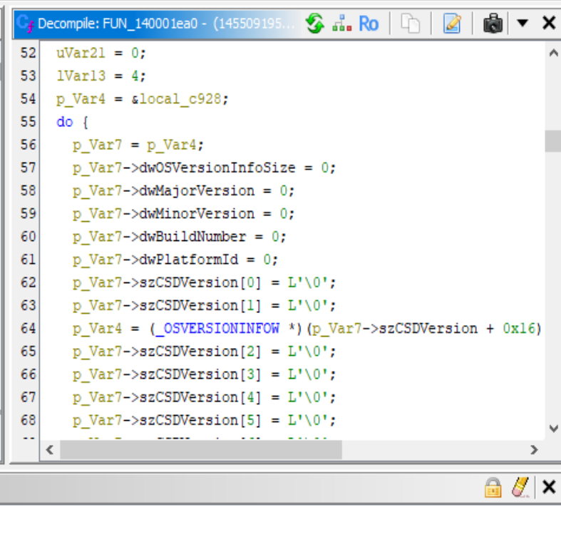

This checks for list of processes embedded in program and if it matches one of these processes "csrss.exe", "explorer.exe", "lsass.exe" it skips else it performs classic code injection / process injection. 

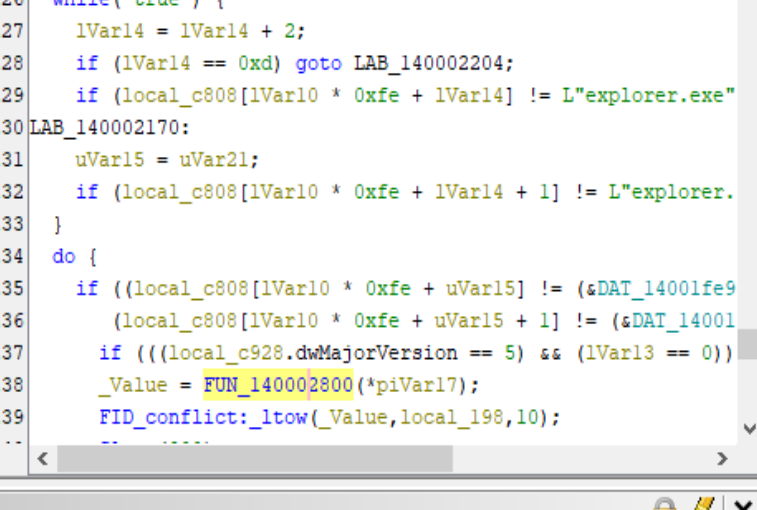

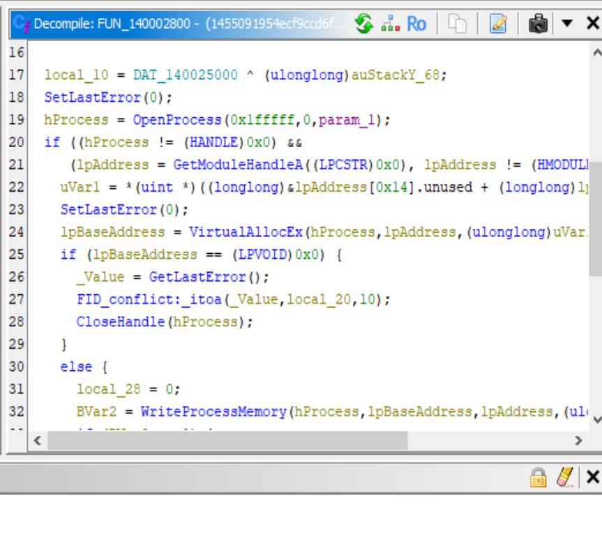

It takes a target process ID, copies the entire malware image into that process’s address space, and forces it to start executing from a specific entry point – effectively running the malware inside a legitimate process to evade detection.

The injected payload when examined contains a function which mostly creates a marker file in a user directory to indicate completion.

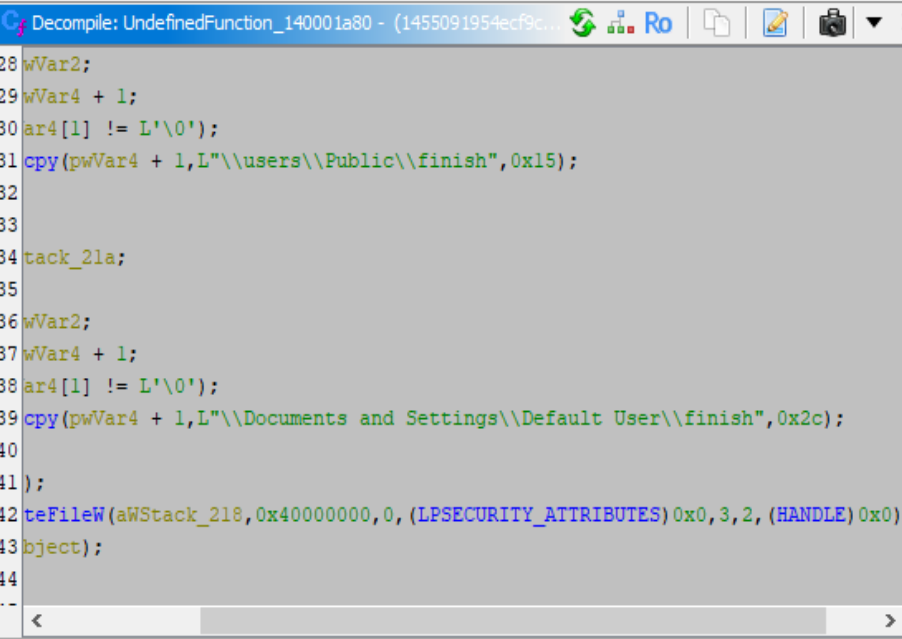

At starting of this function we are able to see function that decrypts and resolves all necessary Windows API addresses at runtime to hinder static analysis and avoid detection by security tools that inspect import tables. Example:

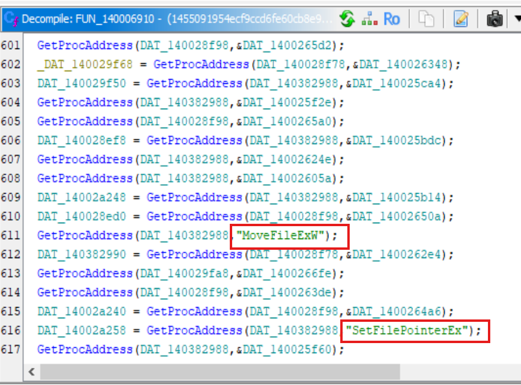

Then comes the core payload execution routine of the ransomware.

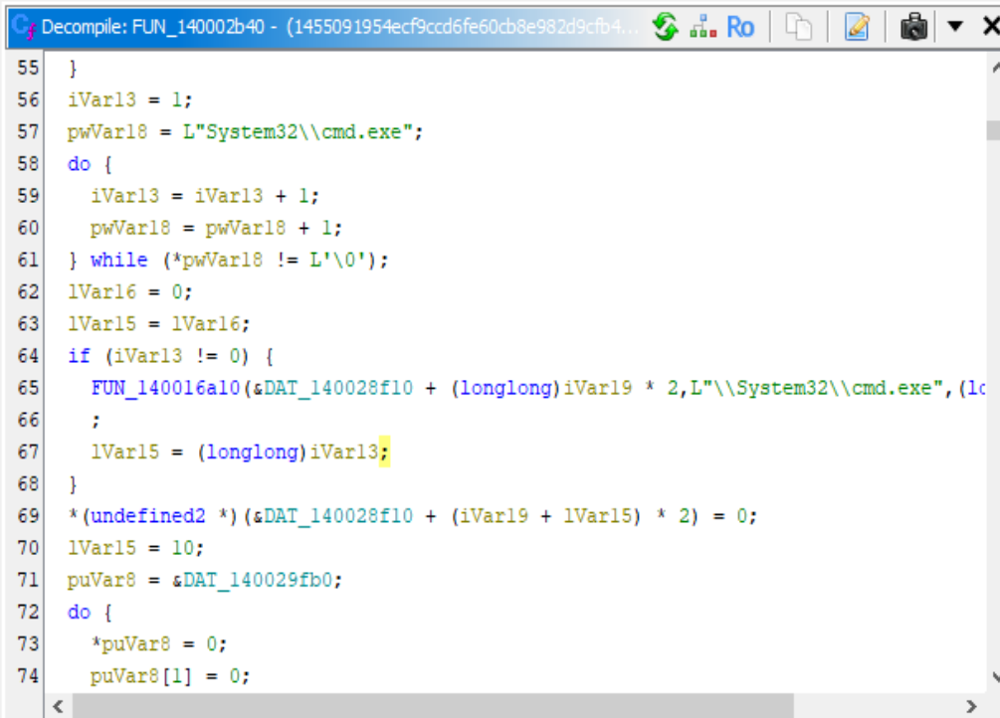

It also has functionality which Deletes volume shadow copies for eliminating recovery options.

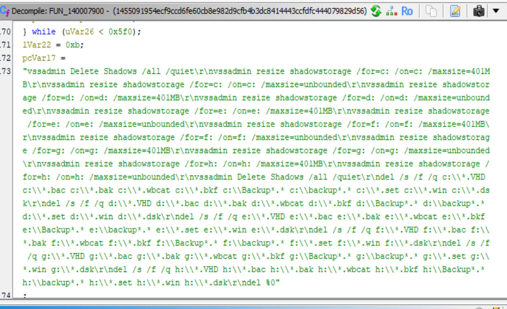

Also for persistance it creates Run key

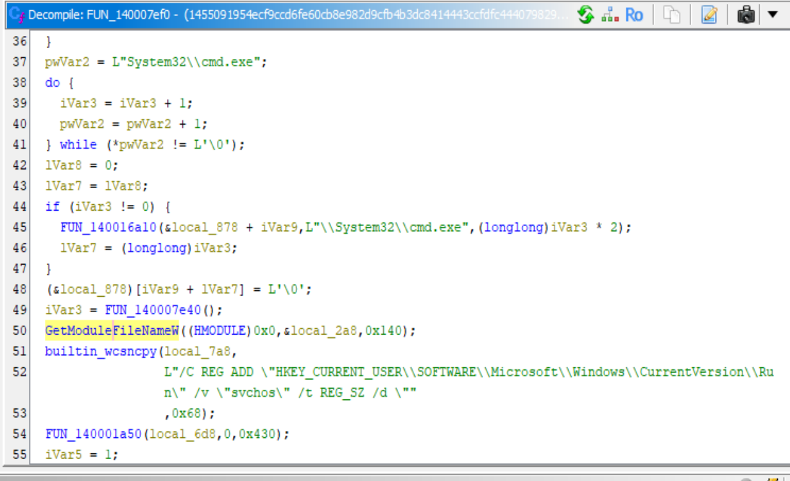

Here is the Ransom Note dropped.

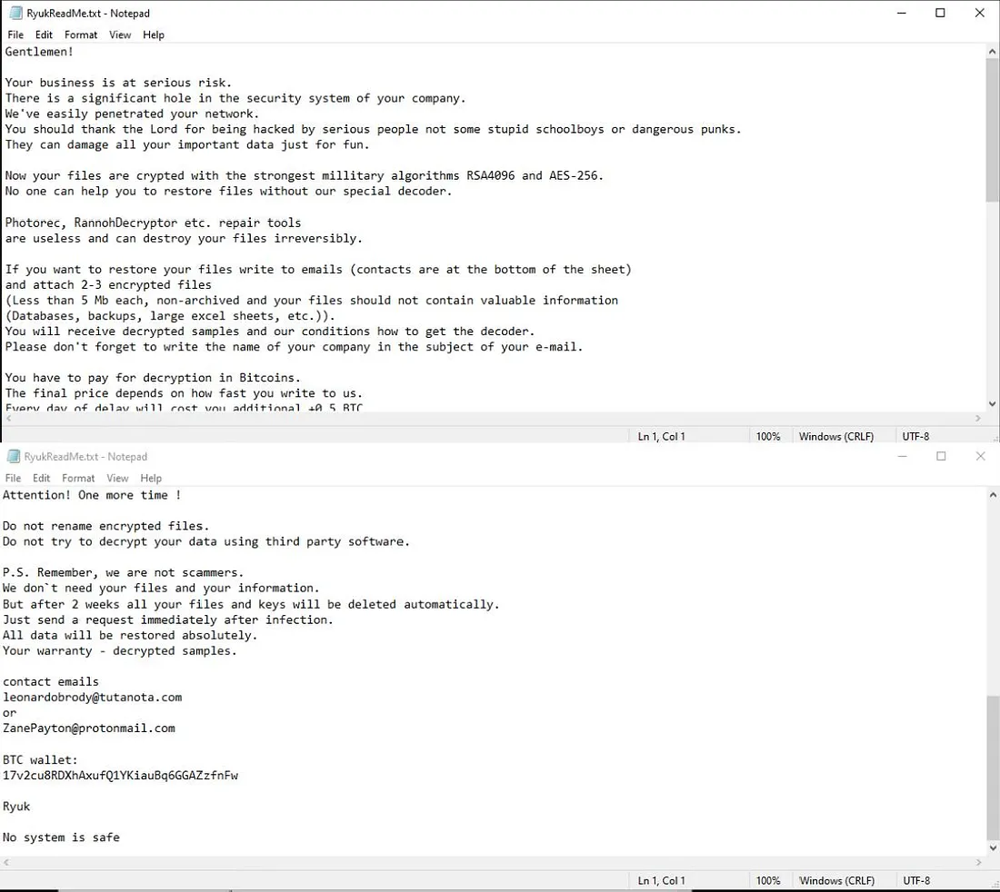
