# Overview

- PE file 32 bit EXE
- Sample compiler 2017

- After successful execution we get ransom note and change in desktop

- Killswitch access, does not run since the domain returns success

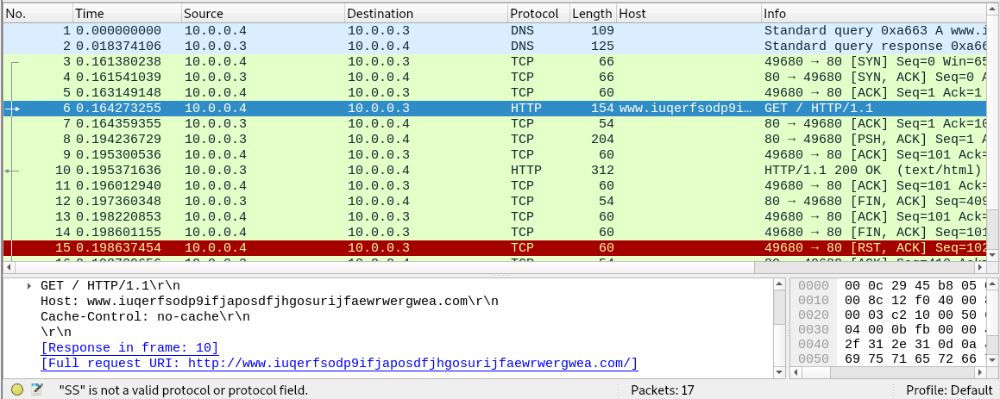

- Once the inetsim/fakenet is turned off, it gets executed and starts creating files, creates threads for encryption and starts encrypting

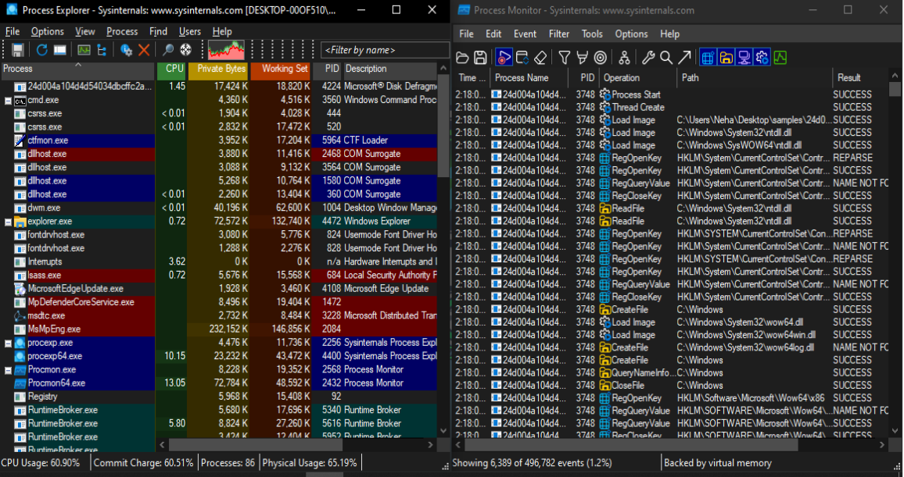

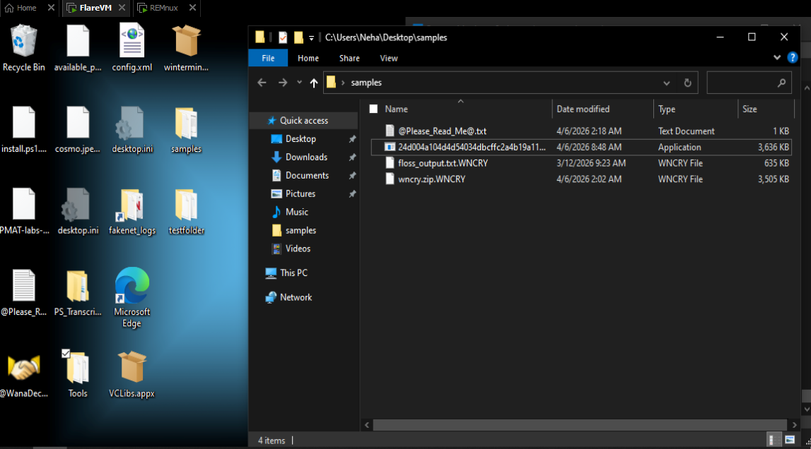

- It also starts searching the network for further propagation

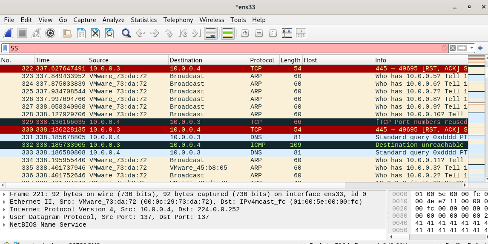
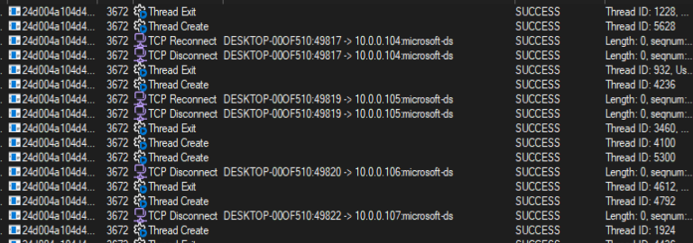

- Resources section contains 32 bit file indicating dropper behaviour

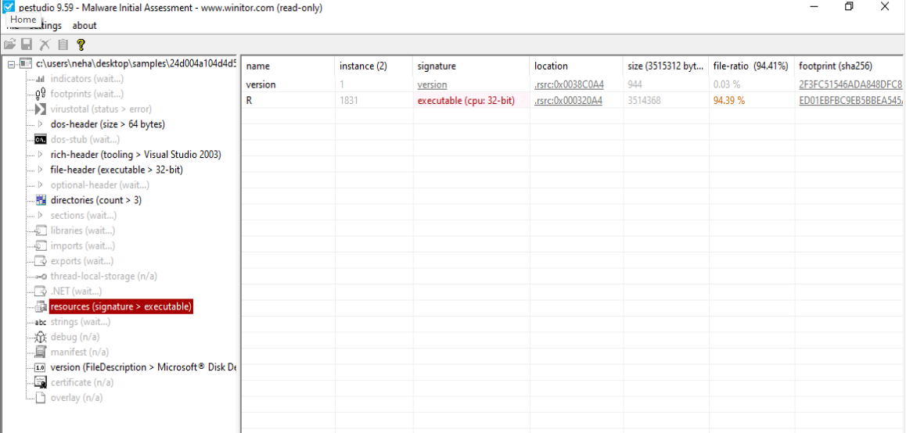

- Strings show the tasksche.exe and service name mentioned mssecvc2.0 used for encryption and propagation

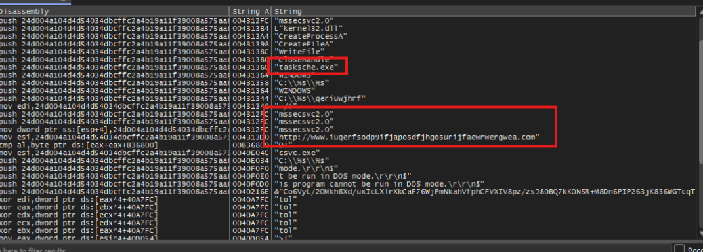

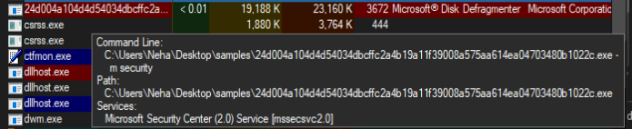

- Creates file tasksche.exe in C:\Windows\ directory

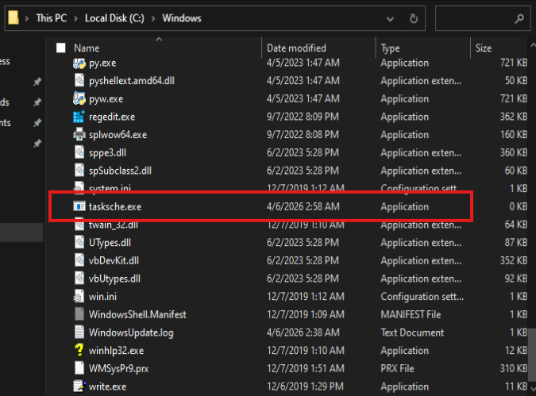

We can confirm from the pestudio rsrc section that this has been dropped by wannacry exe.

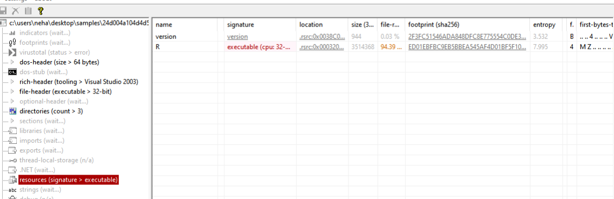

This is used for persistence. It creates a random folder for wannacry staging area inside
ProgramData. After execution of malware on host computer it tries to spread itself on other
windows computers using SMB port 445. It starts encrypting all the files and after that it
displays the ransomware popup and message.

### Advance Static Analysis

Here, we can figure out after entry and kill switch check, it checks for arguments and if no argument calls function which executes ransomware with arguments.

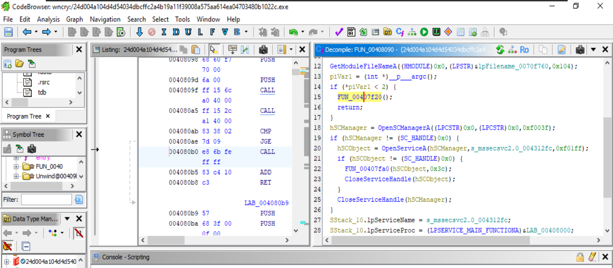

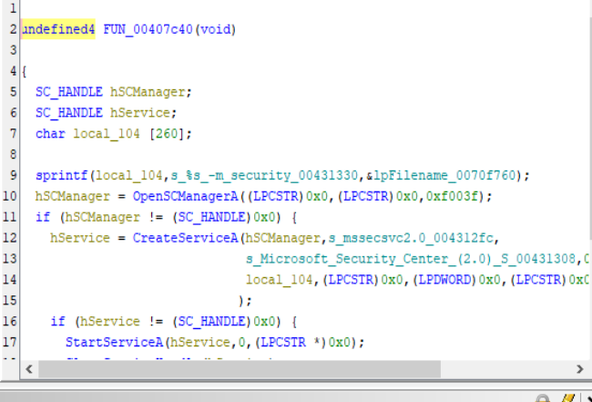

Executing with argument "Path/to/wncry -m security"

This starts mssecsvc2.0 service.

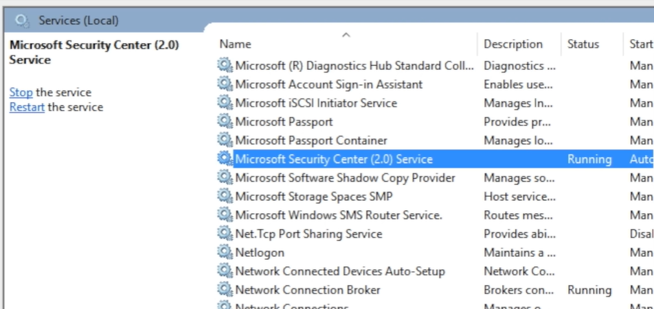

The second function, to create service tasksche.exe and run with /i argument with which the task runs immediately after creation. It writes the resource 1831 to the tasksche.exe

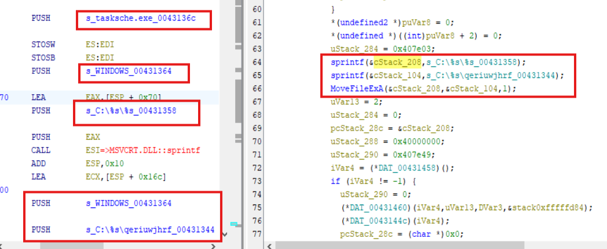

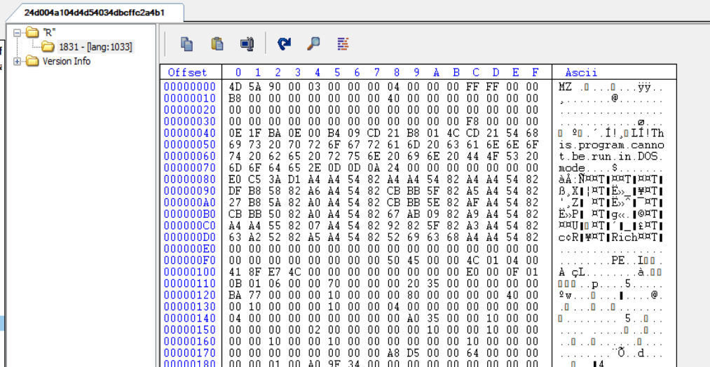

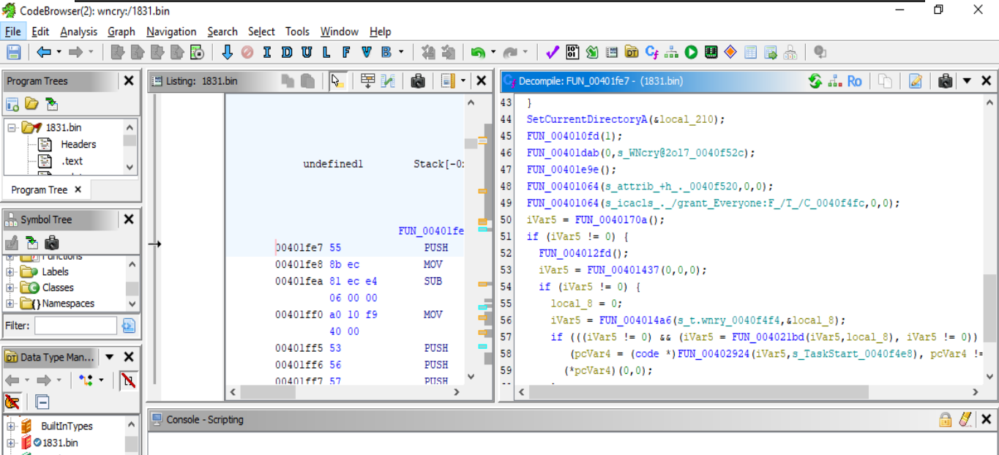

So the 1831.bin, when analysed we can see it generates random string based on computer name, and if it gets /i as argument then creates a hidden directory and copies to itself and creates random service and launch hidden copy of itself.

Registry entry is done for further persistance 

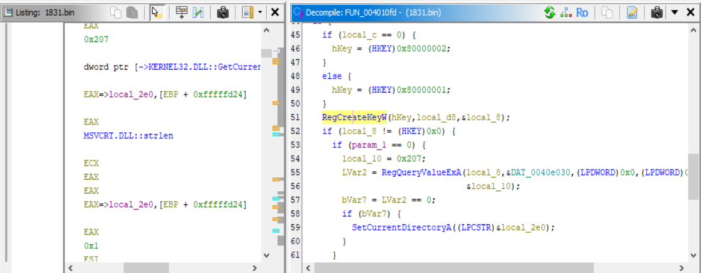

Also 1831.bin contains unzip functionality, so after checking the resource section we find out 2058 XIA section which is a ZIP file

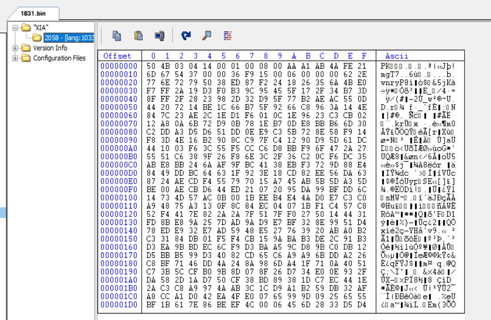

Password to zip is mentioned here

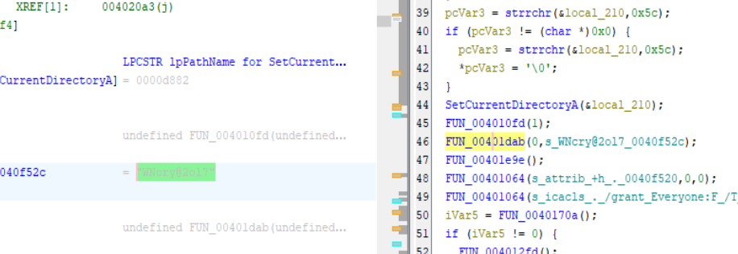

We can see that this zip contains the ransom note along with few more exe

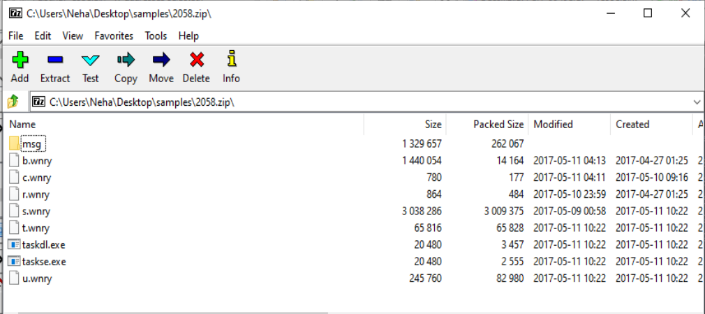

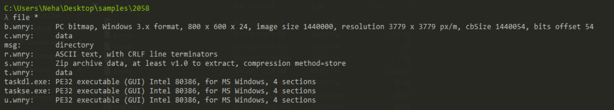

b.bmp or b.wnry

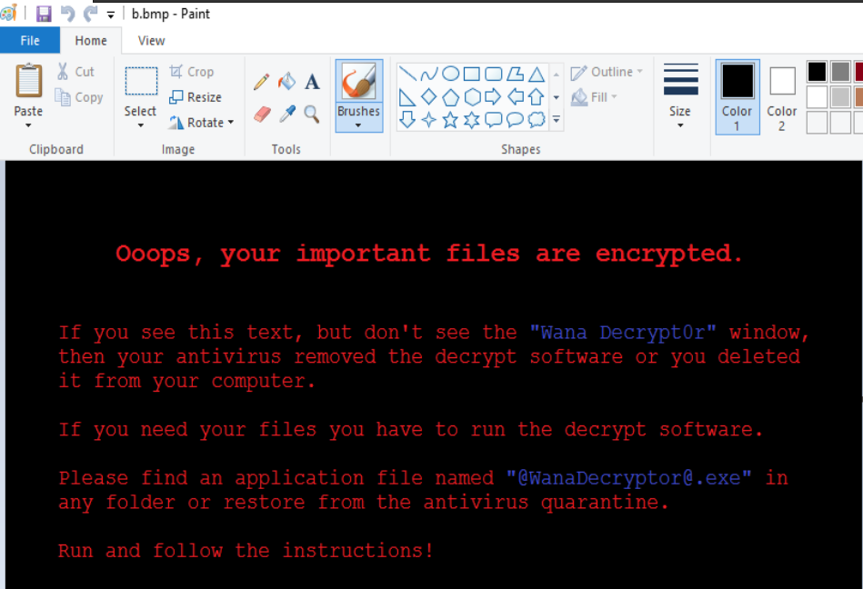

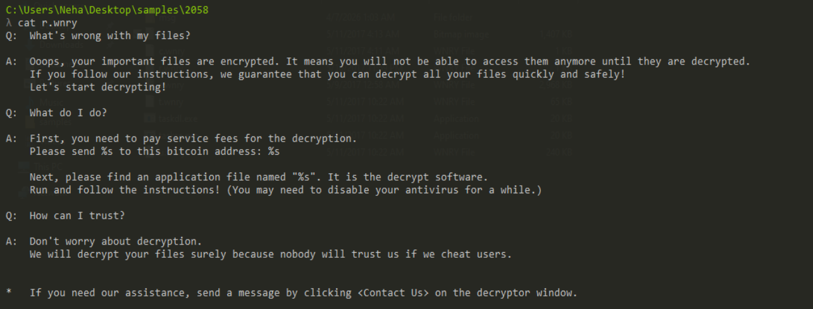

We can also further get from 1831.bin the bitcoin addresses 

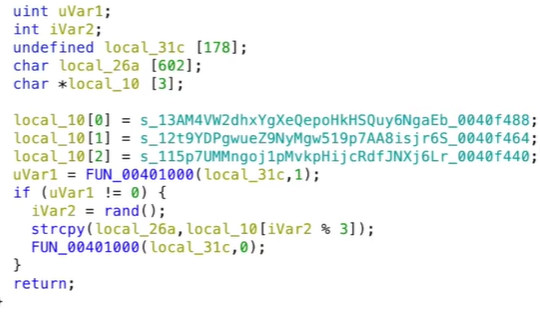

The c.wnry contains string mostly for tor installation.

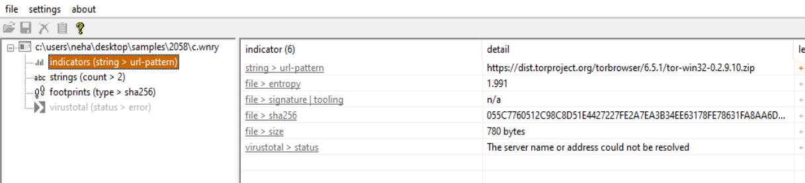

More details can be found here as well : https://hybrid-analysis.com/sample/ed01ebfbc9eb5bbea545af4d01bf5f1071661840480439c6e5babe8e080e41aa/697a13a13e45a335850f0d96